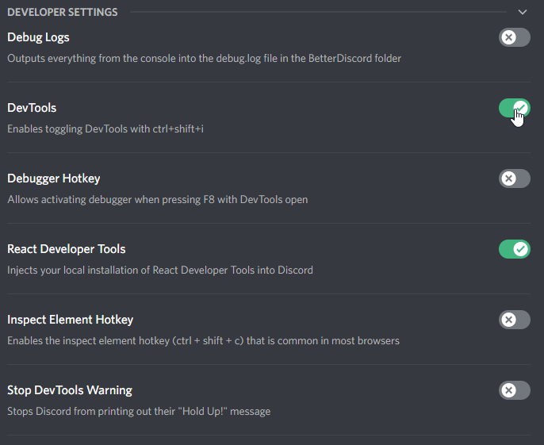

# Developer Tools

These are tools that help with both general web development, and working with the React UI library. 

### Chromium DevTools

If you have past web development experience you are probably already familiar with the Chrome/Chromium DevTools. If not, it might be a good idea to give [its documentation](https://developer.chrome.com/docs/devtools/) a once-over.

Working in this Discord (and BetterDiscord) environment, we have access to these DevTools. Discord has this disabled by default, but it is possible to re-enable this functionality in the BetterDiscord settings. Go to the BetterDiscord Settings page and find the Developer Settings. Then check the option for DevTools.



Once this is enabled, you can press `ctrl`+`shift`+`i` (or for a Mac `cmd`+`opt`+`i`) to open the DevTools just as you would in Chrome.

### React Developer Tools

If you have past web development experience but not a lot of React experience, it might be a good idea to give [its documentation](https://reactjs.org/tutorial/tutorial.html) a once-over. It also may be worth taking a look through [the tutorial](https://react-devtools-tutorial.vercel.app/) for the React DevTools.

Since this environment is one with Chromium DevTools, we can add extensions meant for those DevTools. Unfortunately, this is not packaged with Discord or BetterDiscord, but BetterDiscord can add the React DevTools for you if you download it and place it in the BetterDiscord folder.

To get this setup, download this [special manifest v2](https://github.com/mondaychen/react/raw/017f120369d80a21c0e122106bd7ca1faa48b8ee/packages/react-devtools-extensions/ReactDevTools.zip) version of the extension. Currently the version in the Chrome extension store only works for manifest v3 which is not compatible with electron.

Open your BetterDiscord folder and make a new folder inside called `extensions`. Within this folder, make another new folder with the React DevTools extension ID `fmkadmapgofadopljbjfkapdkoienihi`. The path should look something like `<BetterDiscord>/extensions/fmkadmapgofadopljbjfkapdkoienihi/`. Extract the contents of the `zip` you downloaded directly to this folder.

::: code-group

```console [Windows]
%appdata%\BetterDiscord\extensions\fmkadmapgofadopljbjfkapdkoienihi\
```

```console [Mac]
~/Library/Application Support/BetterDiscord/extensions/fmkadmapgofadopljbjfkapdkoienihi/
```

```console [Linux]
~/.config/BetterDiscord/extensions/fmkadmapgofadopljbjfkapdkoienihi/
```

:::

With this installed, head back to the Developer Settings in BetterDiscord (the same from the [image above](#chromium-devtools)) and this time select the React DevTools option. BetterDiscord should then prompt you to restart.

After restarting, you can press `ctrl`+`shift`+`i` (or for a Mac `cmd`+`opt`+`i`) to open the DevTools and then find that the React DevTools tabs, `Components` and `Profiler` have been added.


If you don't see them there, be sure to check the tab overflow to see if they got added at the end of the list.


<!-- ## Development Environment

### IDE

### Build Tools -->