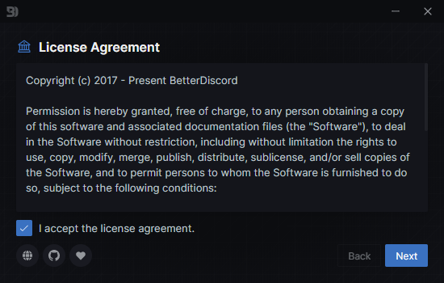
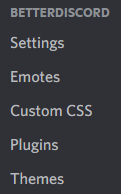

# Installation

:::caution

If you experience any issues following these steps, try the [troubleshooting](../troubleshooting/installation-issues) guide.

:::

## Automatic Installation

1. Go to the [BetterDiscord Website](https://betterdiscord.app) and click the big download button. Save this somewhere on your computer.
2. Open the installer you downloaded in the previous step.
3. Accept the license agreement, and click next to proceed.



4. Select `Install` then click the next button to proceed with installation.
5. Select the version of Discord you want to use. If you're not sure what this means, just select `Stable`. Click the install button when ready.
6. Let the installer process the installation. It should tell you when the installation has completed.
7. Verify that BetterDiscord is installed.
  - Open (or switch to) Discord, and open Discord's settings.
  - Check the tabs on the left for a new section called `BetterDiscord` (see below)



8. Enjoy BetterDiscord!


## Manual Installation

### Prerequisites

- Git - https://git-scm.com/downloads
- Node.js - https://nodejs.org/en/download/
- npm

### Steps

#### 1. Clone the BetterDiscord repository
```sh
git clone https://github.com/BetterDiscord/BetterDiscord.git
```
If this fails due to region lock or something similar, you can download a zipped copy directly from https://github.com/BetterDiscord/BetterDiscord/archive/refs/heads/main.zip

#### 2. Enter the directory
```sh
cd BetterDiscord
```

#### 3. Install dependencies
```sh
npm install
```

#### 4. Build BetterDiscord

This will create a `injector.js`, `preload.js`, and `renderer.js` in the `dist/` folder.
```sh
npm run build
```

#### 5. Install to Discord

##### Install to Stable
```sh
npm run inject
```

##### Install to Canary
```sh
npm run inject canary
```

##### Install to PTB
```sh
npm run inject ptb
```