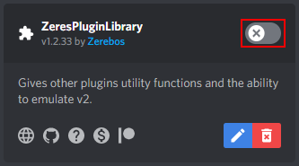

# Installing Addons

1. Find a plugin or theme that interests you on the [BetterDiscord website](https://betterdiscord.app).
1. Download that plugin or theme to your computer.
1. In Discord, go to your BetterDiscord settings and select either the `Plugins` or `Themes` tab depending on what you chose in the first step.
1. At the top click the `Open XXXXXX Folder` button.
1. Drag and drop, or move, the plugin or theme you downloaded into this folder.
1. Go back to your `Plugins` or `Themes` pages and enable your plugin or theme.

