# React Injection

This guide involves [function patching](./patching.md). If you have not read that guide, please take look before continuing.

## Background

### What does it mean?

When we say React Injection, we're referring to adding/removing/altering components in the React render tree used by Discord. In the [React](../intermediate/react.md) section of the guide, we went over rendering our own components using `ReactDOM` which created our own React trees rendering outside of Discord's tree. With injection we can either be part of Discord's tree with our own elements, or we can modify Discord's tree before a render finishes.

### Why would I need it?

1. If you want to take advantage of Discord's own components found through [Webpack searches](./webpack.md), many of them will need to be rendered inside Discord's tree because they depend on different React Contexts.
1. If you want to add a component to the UI and not worry about using `onRemoved` or `MutationObserver` to constantly re-add your elements, patching a render function keeps things consistent.
1. If you want to modify Discord's UI in a seamless way.

### How can I do it?

::: warning

It's important that you make your changes in an error-safe way whenever possible. React errors tend to propagate to the root node and show the "crashed client" screen.

:::

Well if you've got a hang of function patching, then you're already halfway there. You'll need to find your React component in an exposed module and override the render function with an `after` patch. From there you'll have to walk the rendered react nodes to find where you want to make your changes. There are traversal utilities in `BdApi` that can help with this, you'll see more about those in the walkthrough. Then you'll have to make your changes

## Walkthrough

### Setup

::: warning

Due to the nature of client modding, this section could be outdated by the time you read it since Discord's internals are always changing. However, the concepts used and learned here remain the same.

:::

Make sure you've gone over the [DevTools](../../developers/devtools.md), [Function Patching](./patching.md), and [Webpack](./webpack.md) guides before this and have your React DevTools all set up.

What we want to target in this walkthrough is the little section at the top of your DM list.

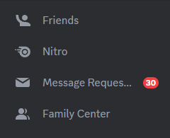

### Finding The Target

We want to add a new button here, so let's select it in React DevTools components panel. Or at least select its closest parent. We find something like this.

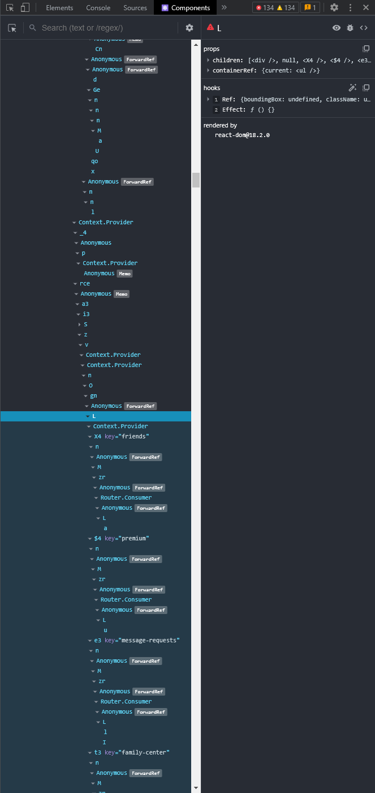

But take a look at the `props` on the right hand side. This seems to be just a simple container that is reusable and not specific to this component. It's not a good target for patching because it would have effects elsewhere as well. The first one that looks like it has potential is shown below.

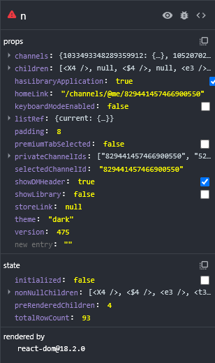

Let's take a look at this component and see if it's exported like we did in the previous chapter. To start, click to view the source of the component.

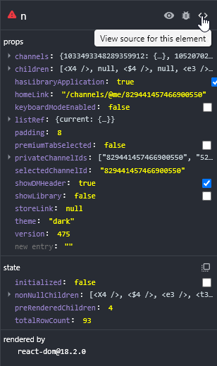

And of course also beautify the code with the button at the bottom left. You'll see a render function much like this.

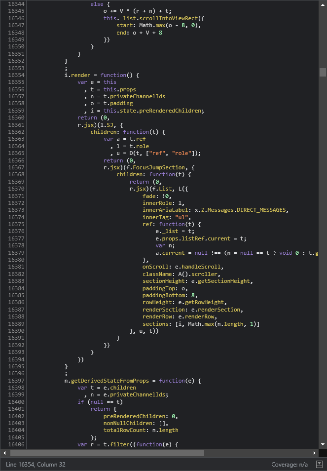

As we did in the last chapter, let's scroll up and check for this `i` to be exported. As we scroll up it appears that `i` is wrapped inside of this module and when we get to the top we can see only an object called `z` is exported. 


Scroll back and you can find this `z` that uses `i` internally and does not expose it in any other way. Let's go back to the Components panel and keep going up this subtree until we find another candidate. We find one at the top of our subtree.

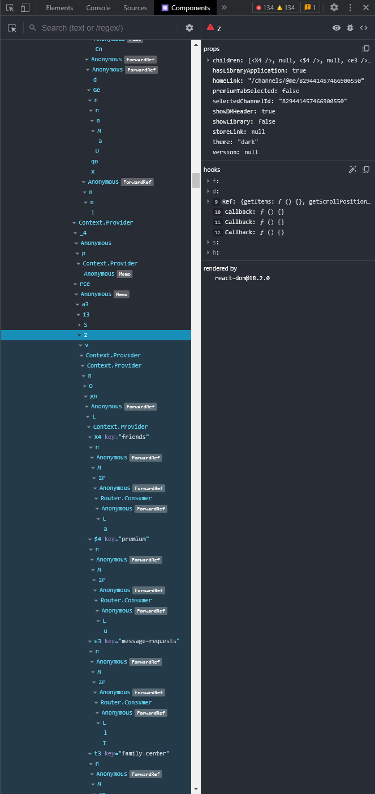

Let's take a look at the source once more. The code looks oddly familiar and it's already formatted. It's actually the same module we were looking at before! Except this time we are using the `z` component, so since we know this one is exported, we have found our target.

### Getting The Target

The next step to adding our button is finding a way to filter for this component through the Webpack module search. The easiest way is with keys, so let's take a look at this `z` object and see what's available.

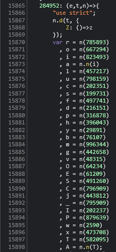

Unfortunately for us, this is a functional component, so there are no keys or prototypes to go off. A good option here is to search via strings, but we want to make sure we use something unique yet stable to changes. Since this seems to be the private channel list component, something related to that would be consistent across most updates. Near the top of this function we can see a call to `getPrivateChannelIds`, so let's try with this.

First, we want to try using `getAllByStrings` and see how many results we get. We do this to make sure our string choice is specific enough to select _only_ our target component.

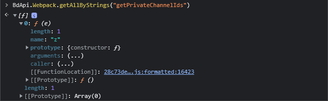

It seems this string actually works just fine. We got only one component, and it's the component we're targeting. But before we move on to patching, take a look at the return value we get with `getByStrings`. We get just the function itself. And if you remember your function patching from [our guide](./patching.md) then you know that this is not enough to patch. But we do know that this function is a default export, so we don't necessarily need to use `getWithKey`, we can simply add `{defaultExport: false}` as we talked about in our [Webpack](./webpack.md) guide.

```js
BdApi.Webpack.getByStrings("getPrivateChannelIds", {defaultExport: false});
```

### Patching The Target

Now that we have our target component and our key `Z`, we can actually get to patching the component. The easiest way to understand what we want to do is to see it. So let's make that happen. Directly in your console you can try this out.

```js
const PrivateChannels = BdApi.Webpack.getByStrings("getPrivateChannelIds", {defaultExport: false});
BdApi.Patcher.after("debug", PrivateChannels, "Z", (_, __, returnValue) => {
    console.log(returnValue);
});
```

With this simple patch, we will log out the return value on ever render call but let the original return value still work. With that in place, try switching to a guild and then back to your DM list. You should see a new log in your console.

::: details Right-Click
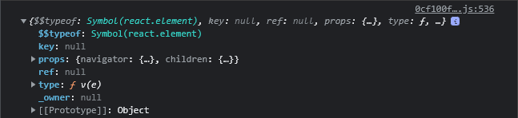
:::

::: details Function Location
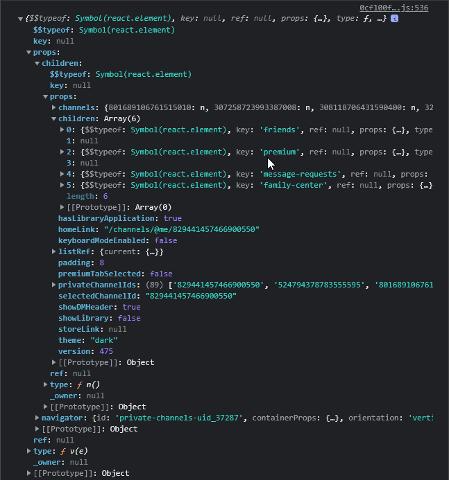
:::

What you see here if a fairly typical result of one of these render calls. Take a second and get familiar with the structure, it's likely you'll be seeing a lot more of them going forward. However, since we want to see where to add our component, expand the tree out like we did above in the second image.

Take a look at the objects near the cursor in the image. This seems to be exactly where we want to render. Take a note of the object path to this object or copy it using the built-in tool.

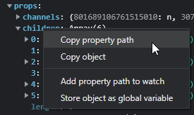

You'll end up with a path like `returnValue.props.children.props.children`. Also note that this is an array of children, so it's easy enough to just append to this array without any special handling. Let's give it a try in our patch.

::: tip

It's a good ideal to undo the previous patches with `BdApi.Patcher.unpatchAll("debug")` before subsequent patches.

:::

```js
const PrivateChannels = BdApi.Webpack.getByStrings("getPrivateChannelIds", {defaultExport: false});

BdApi.Patcher.after("debug", PrivateChannels, "Z", (_, __, returnValue) => {
    const myElement = BdApi.React.createElement("button", null, "Hello World!");
    returnValue.props.children.props.children.push(myElement);
});
```

This patch should just add a simple button saying `Hello World` to this list of buttons. After patching be sure to switch views again to trigger a re-render.

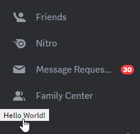

And there we have it! A react button of our own creation rendered inside of Discord's React tree inside of Discord's UI. There are more complicated situations, but this should be a good jump start to help you get on your way. If you're interested in more, there's some additional information below.

## Tips & Tricks

### Error Safety

If your patch is dangerous or has potential for error, you should definitely be adding some sort of error safety to your patch. If the code itself is dangerous or complex, try using a `try..catch` where the `catch` returns the original return value.

```js
try {
    // My patch info
}
catch {
    return returnValue;
}
```

You can also make use of error boundaries to prevent the error from crashing the client. Take a look at this [article from React](https://react.dev/reference/react/Component#catching-rendering-errors-with-an-error-boundary) for information on implementation.

### Multi-Patching

One thing to keep in mind when making your patches is that you may not be the only plugin attempting to patch a certain component. There are a couple quick steps to massively improve your compatibility with one another.

Let's say we want to add a child component where one doesn't exist. Simple as setting the `children` property to your component right? Well that works great but what about if another plugin wanted to do the same? It would have been better if you started with an array `[]` so future patches can just add to the array.

In general using arrays for children is preferred. Whether you're adding, modifying, or even removing components, trying to leave everything in the form of an array makes it easier for everyone.

### Tree Traversal

Let's go back to our example from the walkthrough. We directly used the property path for the patch which is very vulnerable to breaking. If Discord even slightly changes the structure there, our patch will not work. Moreover, it will even cause errors and potentially crash the client. How can we do this differently? Well we know that we wanted to append to the array of buttons and the buttons have `key` values that identify them. But we don't want the buttons themselves, we want the `children` array. So what kind of filter could match that array? `children.some(element => element.key === "friends")`.

We can combine this with `BdApi.Utils.findInTree()` to automatically locate this specific array anywhere in the tree. First, we have to know that `findInTree` take 3 arguments, first the tree to walk. We already have that. Next it takes some filter that is checked against every property checked. We have that too. Last is an object with some configuration like which keys should be walked. In this case since we are always looking for a `children` array, we only need to walk `props` and `children`.

```js
const myFilter = prop => Array.isArray(prop) && prop.some(element => element.key === "friends");
BdApi.Utils.findInTree(returnValue, myFilter, {walkable: ["props", "children"]});
```

Running this with the return value from earlier works exactly as expected.

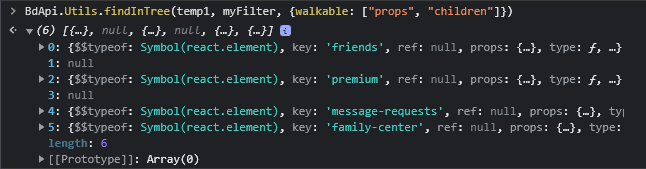

Before we move on, notice that we added an `Array.isArray()` check to the filter. That's because `props` will also be walked but is not going to be an array, so we wanted to guard against that.

Now we can actually rewrite our patch from earlier.

```js
const myFilter = prop => Array.isArray(prop) && prop.some(element => element.key === "friends");
const PrivateChannels = BdApi.Webpack.getByStrings("getPrivateChannelIds", {defaultExport: false});

BdApi.Patcher.after("debug", PrivateChannels, "Z", (_, __, returnValue) => {
    const myElement = BdApi.React.createElement("button", null, "Hello World!");
    const buttons = BdApi.Utils.findInTree(returnValue, myFilter, {walkable: ["props", "children"]});
    // highlight-next-line
    buttons?.push(myElement);
});
```

It's an easy change but it makes the code so much more robust. And take a look at the highlighted line. We're making use of the optional chaining operator `?.` which will protect us in cases where `findInTree` is unable to find our target due to Discord changes. Now you can take this technique and make even the most complex patches much more resilient to updates.