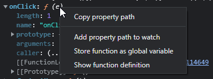
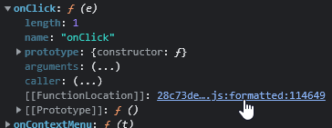
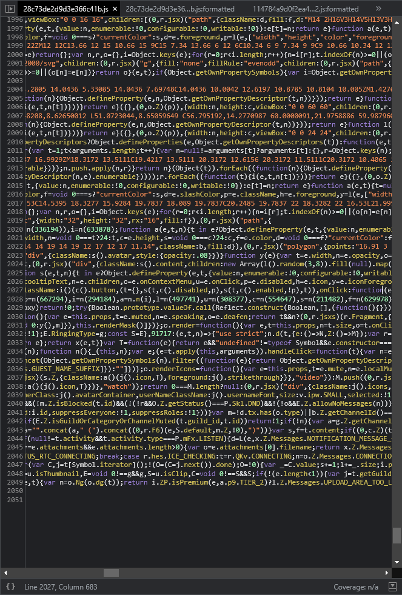
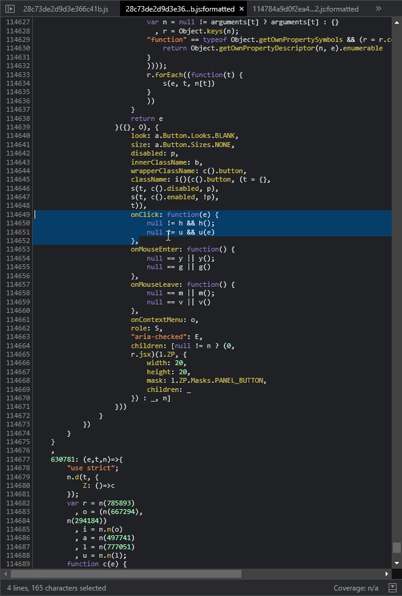
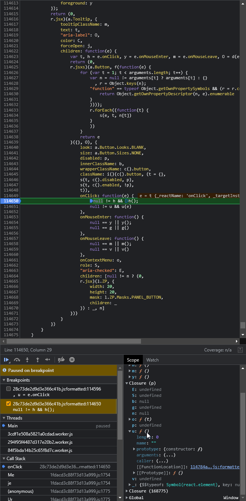
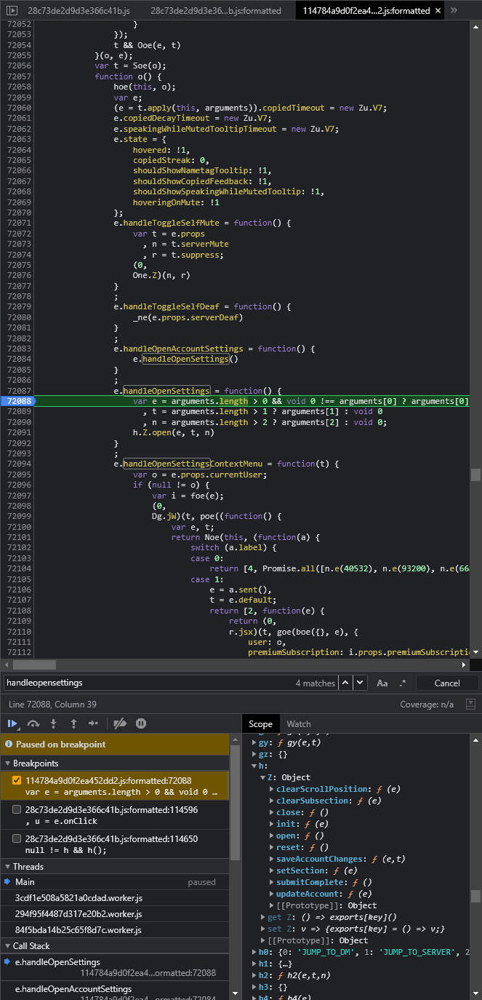
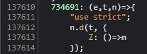
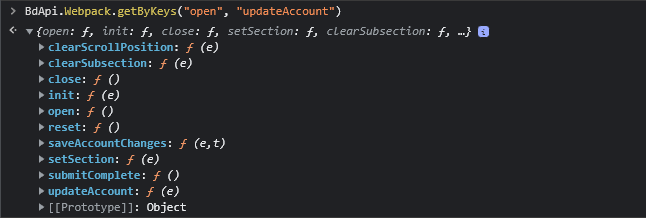
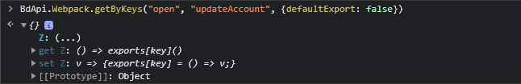
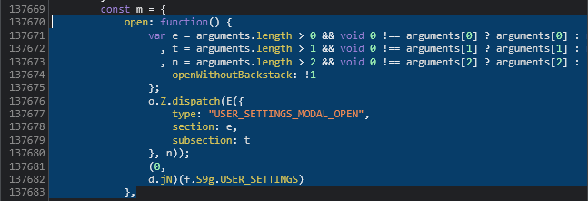

# Webpack Modules

If you've read our guides to the Discord Environment and our guide on Bundling, then you already know what Webpack is. You'll also know that Discord uses Webpack and that Webpack bundles your code modules into one large file. So when we talk about Webpack Modules in plugin development, we're referring to Discord's own modules that we retrieve through their instance of Webpack! There's some background work that's required in order to properly expose Discord's webpack modules and make them usable and modifiable for plugins. But thankfully, BetterDiscord takes care of all of it for us and even provides a handy API under the `BdApi.Webpack` namespace. You'll learn more about how to use this API below.

## Types of Modules

Discord exports many kinds of modules, and their internals are always changing unbeknownst to us. But we do our best to keep up. So what are the most common types of modules we can find in Discord?

| Type | Description |
|:-----|:------------|
|React Components|Functional, class style, or even memo'd react components.|
|Stores|Modules that store or cache information locally.|
|Classes|These are modules that stores **CSS class names**.|
|Utilities|Usually logical groupings of helpful functions.|
|Constants|Large lists of constant values like strings, or enums.|
|External|Any externally included module like React.|

Plugins are able to access all of these types of modules through BetterDiscord's API. The two most commonly used types are `Stores` for getting and displaying information, and `React Components` for patching which we'll get to in [the next guide](./react.md).

## Finding Modules

How do we actually find these modules? First, let's take a look at the tools at our disposal. We of course have the Chromium DevTools as we talked about in our [developer guide](../../developers/devtools.md), which is absolutely crucial. But we also have BetterDiscord's Webpack API. You can take a look at the [api reference](../../api/webpack.md) for this namespace if you want a full list, we'll be going over the most frequently used ones here.

## Filters

The API for searching through modules uses the concept of "filters". At it's core, a filter is just a function that gets a reference to a module and returns `true` if it's the one you want, and `false` otherwise. Being able to craft these filters is important, and there are some helper functions from the API to make it easier.

| Filter | Description |
|:-------|:------------|
|Display Name|This matches modules with a `displayName` property that matches your input.|
|Keys|This matches modules that match a list of keys.|
|Prototype Keys|This matches modules that have a `prototype` and that `prototype` matches a list of keys.|
|Regex|This matches modules that match a regex pattern when stringified.|
|Store Name|This matches stores by a given internal name.|
|Strings|This matches modules that contain a set of strings when stringified.|

Of course, you are not required to use these helpers at all! You can use a completely custom function and pass it to `BdApi.Webpack.getModule`.

## Reverse Engineering

::: warning

Due to the nature of client modding, this section could be outdated by the time you read it since Discord's internals are always changing. However, the concepts used and learned here remain the same.

:::

Now that we know what information we can search on, how do we even find a module we want to get? And once we find it, how do we know whether it's even accessible? Keep in mind that some modules in Discord are completely wrapped and cannot be accessed through this API or through reflection of any kind.

But to answer these questions, let's step through a very simple example. Let's say we want to open settings programmatically. We know that the settings button can do that, so we'll start there. Begin by selecting that element and printing it out in console with `$0`. You'll see in the autocomplete that it has some property that looks like `__reactFiber$2oq7t5kq3k5`. Go ahead and select that and print it out. This is the data React currently has about this node. Using this is a good way to understand how React works and a great way to start with reverse engineering in Discord. Through this you can walk the React tree and see all the elements React knows about. But we are more interested in the properties of this `button` because we want to essentially duplicate the `onClick` listener.

Now let's print out the property that looks like `__reactProps$2oq7t5kq3k5` instead. You'll see in this object all the React props specific to this element including an `onClick` function. Let's dive into this either by right-clicking and selecting `Show Function Definition` or by expanding the function and clicking on the function location.

::: details Right-Click

:::

::: details Function Location

:::

That will bring you to a large minified script that is hard to understand. But at the bottom left of your sources panel you should see a little `{}` icon. Go ahead and click that, it will format and beautify the file into something somewhat understandable.

::: details Minified

:::

::: details Beautified

:::

From what we see in this click listener, it looks like the function `u()` is the one really getting the event and processing it. Let's set a breakpoint inside this listener and click on the button. This will show us all the values at this point in time and we can figure out the value of `u`.



Take a look at the bottom right of our panel here. `u` seems to be part of the current closure and it corresponds to a function in another script. Once again lets go see the source of that script and beautify it. This leads us to a function called `handleOpenAccountSettings` which calls `handleOpenSettings` which happens to be right there as well. It seems to open settings, this calls `h.Z.open`. The easiest way to find out is once again a breakpoint.



Here we find `h` is an object with multiple functions. Pick the `open` function and view and beautify the source. We can immediately see that this function is part of an object called `m`. So we need to find out if this is exported somewhere that we can access it. Let's scroll up a bit to see if we can find something that matches this pattern:

```js
  9999: (e,t,n)=>{
    "use strict";
    n.d(t, {
        Z: ()=>po
        kWm: ()=>lP
        ... // and so on
    })
```

We quickly find a little section like that just above.



And it looks like `Z` corresponds to our object `m` which is perfect, it means that our object is exported and accessible.

## Crafting A Filter

If we look at our module export above, we see that our object `m` isn't directly exported to the root of the module but to a key `Z`. `Z` generally means it was the `default` export from an ESM-style module. Because it's such a common occurrence, BetterDiscord's API will automatically search through the default exports *and return it* unless you tell it otherwise.

But how do we even craft a filter for this? Go back and look at our `m` object. You'll see there are more keys than just `open`. So `getByKeys` is likely going to be our best bet here. Choose another key or two to go with `open` and use `BdApi.Webpack.getByKeys`. We'll be using `updateAccount`.



And there it is, the object we wanted, with the function we wanted. You might have also noticed it did return the object itself and not the whole module with the object being wrapped in `Z`. For learning's sake, let's try to disable that feature and see what happens.



Now the `Z` is back and BetterDiscord returned the whole module, not just the default export. So let's stick with the first version since we just want to use the object directly. And let's take a look at the `open` function definition and figure out how it works so we can use it.



It looks like this function can take a variable number of arguments (up to 3), but it generally expects 2, `e` and `t`. Looking at where they are used, they correspond to `section` and `subsection` respectively. By now, you should be an expert on breakpoints, so let's do it one more time and note down the values that clicking the settings button causes here.

It turns out, argument `t` isn't even used in our use-case, and `e` is set to `My Account`. Which for those using Discord in English, is the name of the active tab when first opening settings. So that means we can easily open settings programmatically now!

```js
const SettingsOpener = BdApi.Webpack.getByKeys("open", "updateAccount");
SettingsOpener.open("My Account");
```

Try running that in console and you should see the settings panel appear! If you've made it this far, congratulations, that was a crash course on reverse engineering in Discord. If you're interested in some more information, keep reading. Otherwise, feel free to go to the next guide.

## Additional Info


### getWithKey

Do you remember this pattern from earlier?

```js
  9999: (e,t,n)=>{
    "use strict";
    n.d(t, {
        Z: ()=>po
        kWm: ()=>lP
        ... // and so on
    })
```

Did you notice that `Z` wasn't the only option here? `kWm` is also there, and it represents other potential exports by a module. Discord uses [SWC](https://swc.rs/) to transpile their code and it mangles the name of exports into unreadable things like this. This is fine if the export these keys point to is an object. But when the key points directly to a function, we will need the name of the key as well in order to perform [function patching](./patching.md).

Thankfully, BetterDiscord has an API exactly for this case because it can be so frustrating to do manually. It's called `BdApi.Webpack.getWithKey` and as the name suggests, it gets a module/value along with the corresponding key. Here is a quick example usage:

```js
const [ctxMenuModule, openKey] = BdApi.Webpack.getWithKey(m => m?.toString?.()?.includes(`n?n(e()):n`), {searchExports: true});
Patcher.after(ctxMenuModule, openKey, ...);
```

Here we are looking for the function that opens the context menus in Discord and immediately using these values to patch the function. You can use `getWithKey` in combination with any filter that suits your needs for the module you are targeting.

### searchExports

You probably noticed on the example directly above we used `{searchExports: true}`, this is an option available to all the Webpack APIs that causes BetterDiscord to loop over all the exports of every module to see if they match your filter rather than testing the whole module at once. This is used a lot in plugins when searching for objects, classes, and instantiations since patching with the key is not crucial.