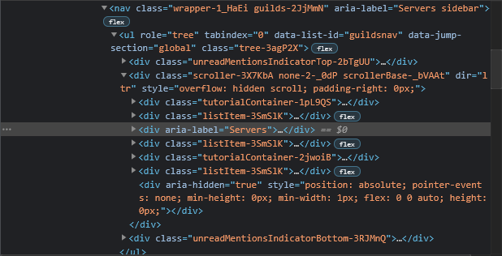

# Using the DOM

If you're unfamiliar with the DOM it might be worth taking a look at the [MDN documentation](https://developer.mozilla.org/en-US/docs/Web/API/Document_Object_Model) about it.

Since we already know from [previous pages](../introduction/environment) that Discord is essentially a Chromium browser, we can access the DOM using typical methods.

```js
// Create a reference to the document
const myDocument = document;

// Create an element
const myElement = document.createElement("div");

// Get an existing element by selector
const existingElement = document.querySelector(".button");

// Add an event listener
existingElement.addEventListener("click", () => {console.log("clicked!");});
```

You should hopefully be familiar with everything shown above, if not it might be a good idea to check out the MDN link at the beginning of this page.

Now as to how we can apply this to plugins in Discord, let's try an example of adding a button that shows an alert when clicked. It might look something like this:

```js
const myButton = document.createElement("button");
myButton.textContent = "Click me!";
myButton.addEventListener("click", () => {window.alert("Hello World!");});
const root = document.getElementById("app-mount");
root.append(myButton);
```

You can try this right in the console of your Discord client, and you should see a button appear at the bottom of your screen. Clicking it should give you a `Hello World!` popup.

One thing to note from this code is the root container `document.getElementById("app-mount")`. Since Discord uses React as their front-end rendering system, their app needs to be "mounted" into the normal DOM hierarchy. Typically, this is in a root container with ID `app-mount`.

And while that works, it's not very practical or useful. And the location of the button is terrible. So what if we wanted to add it to the end of the guild/server list? Let's give it a try!

First, we need to find the DOM subtree for the guild list, the easiest way to do that is to use inspect element from [devtools](../../developers/devtools) and select the guild list on the left.



If yours looks like the one above, you've got the right element. Now we need to come up with a selector for the element. You can try to use the built-in method by right-clicking the element, then going to `Copy > Copy Selector`. But that usually yields unwieldy selectors like `#app-mount > div.appDevToolsWrapper-1QxdQf > div > div.app-3xd6d0 > div > div.layers-OrUESM.layers-1YQhyW > div > div.container-1eFtFS > nav > ul > div.scroller-3X7KbA.none-2-_0dP.scrollerBase-_bVAAt > div:nth-child(3)` in this case.

So let's do it manually. Since this element has no `id` or `class` but it does have an `aria-label` attribute, it seems obvious to use an attribute selector like `[aria-label="Servers"]`. This does have a big problem however. This value changes based on the language the user has Discord set to. So while this may work for you in English, it won't work for many many others. If you're unfamiliar with `aria-label` or accessible web browsing in general, once again [MDN has great documentation](https://developer.mozilla.org/en-US/docs/Web/Accessibility/ARIA/Attributes/aria-label) on this topic.

Since that didn't work out, let's take another look. We can see there are a couple unique classes in the ancestor hierarchy like `tree-3agP2X` and `guilds-2JjMmN`. We can combine these with the fact the `aria-label` only exists on the element we are targeting to create a selector like `.tree-3agP2X > div > div[aria-label]`. Since this doesn't depend on the *value* of the `aria-label` attribute, it will still work regardless of language. Note: there are other selectors that work as well, this is just an example.

::: tip

Many of Discord's classes end in weird strings like `-3agP2X` because they use a system that prevents class collisions automatically. This means these strings are subject to change. A better way to get the desired class name will be covered in later sections.

:::

If we use our selector with our previous code, we can add our button to the guild list.

```js
const myButton = document.createElement("button");
myButton.textContent = "Click me!";
myButton.addEventListener("click", () => {window.alert("Hello World!");});
const serverList = document.querySelector(".tree-3agP2X > div > div[aria-label]");
serverList.append(myButton);
```

If you try this out on console, you should see your button at the bottom of the guild list (you may have to scroll down). Clicking it should still cause your alert to appear.

One problem that is common when working with Discord (and react) is sometimes your elements disappear. This could be from React refreshing the view and purging your element, or the user changes views (changing channel or server). This may even happen to your button in the guild list when that refreshes.

How can we prevent this? Well we can't with normal DOM manipulation. But we _can_ work around it. We can detect when our button is removed and re-add it. Enter [mutation observers](https://developer.mozilla.org/en-US/docs/Web/API/MutationObserver).


```js
// This part adds our button
const myButton = document.createElement("button");
myButton.textContent = "Click me!";
myButton.addEventListener("click", () => {window.alert("Hello World!");});
const serverList = document.querySelector(".tree-3agP2X > div > div[aria-label]");
serverList.append(myButton);


// This part waits for it to be removed
const myCallback = mutations => {
    // We only care about our button being removed
    if (mutations.removedNodes.length === 0) return;

    // Convert to array to allow array functions
    const removedNodes = Array.from(mutations.removedNodes);

    // We only care about our button
    if (!removedNodes.includes(myButton)) return;

    // Getting here means our button was removed, lets add it back
    serverList.append(myButton);
};
const myObserver = new MutationObserver(myCallback);
const observerOptions = {
    childList: true,
    subtree: false // We don't need subtree, only direct children
};
myObserver.observe(serverList, observerOptions);
```

This will now re-append the button anytime it is removed from the server list. The code is a little inconvenient to write, and it's very specific to that button. But thankfully, [BdApi](/api/bdapi) has a utility function that can help called `onRemoved`. This code rewritten would look something like this:

```js
// This part adds our button
const myButton = document.createElement("button");
myButton.textContent = "Click me!";
myButton.addEventListener("click", () => {window.alert("Hello World!");});
const serverList = document.querySelector(".tree-3agP2X > div > div[aria-label]");
serverList.append(myButton);

// This part re-adds it when removed
BdApi.DOM.onRemoved(myButton, () => {
    serverList.append(myButton);
});
```

This is much cleaner and more descriptive of the action being taken. This is just one of the many helper functions that exist in `BdApi`. You'll learn more as you go through the docs. In fact, there are two more functions `addStyle` and `removeStyle` that can be helpful for our button example.

These are pretty simple and straightforward. Say we added a class `my-button` to our button from before. We could then style it with css externally using this snippet:
```css
.my-button {
    padding: 4px;
    border-radius: 5px;
    background: black;
    color: white;
}
```

which is great and works, but we need to have it in our plugin. You can either create and add your own stylesheet to the document using the techniques at the beginning of this page, or you just use `BdApi.DOM.addStyle`. Given an ID and your css, it'll take care of the rest.

```js
BdApi.DOM.addStyle("myPluginName", `.my-button {
    padding: 4px;
    border-radius: 5px;
    background: black;
    color: white;
}`);
```

which can later be removed using the same ID from before

```js
BdApi.DOM.removeStyle("myPluginName");
```

Try playing around with this and all the techniques discussed above. When you feel comfortable, go ahead and move on to the next section.