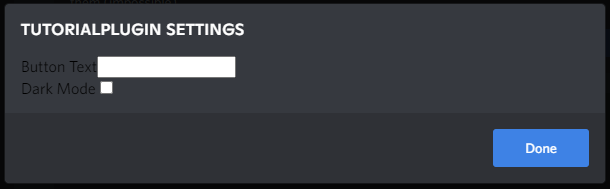

# Plugin Settings

In BetterDiscord, plugins settings are very open-ended and flexible; there is no one correct way to do them. In this section we're going to look at one way to manage your settings. This includes using BetterDiscord to save and load the settings data, and making use of the `getSettingsPanel` function described in [plugin structure](../introduction/structure).

Using `getSettingsPanel` is the recommended way to show a settings panel to the user because it creates a consistent flow for the user. If every plugin added a button in the Discord UI for their own settings button, it could end up chaotic. Instead using `getSettingsPanel` allows your plugin to have a settings button on the plugins page in the BetterDiscord settings. Most users will expect a plugin to implement this if they have settings of any kind.

## Managing Settings

### Structure

Typically, settings are managed and stored in the form of an object literal.


```js:line-numbers
const mySettings = {
    setting1: "value",
    setting2: 0,
    setting3: [1, "foo"],
    setting4: {
        subsetting: "red",
        subsetting2: "see-through"
    },
    setting5: false
};
```

Using an object like this has many benefits:
- Easy to read and understand
- Can hold different types of values
- JSON-compatible
- Quick lookup and addition

This can even be extended and organized further to include categories:

```js:line-numbers
const mySettings = {
    colors: {
        accent: "#ff0000"
    }
    general: {
        config: {
            value: 0
        }
    }
}
```

Where you store this object in your plugin is up to the individual developer. It may also depend on the style of plugin you create. If you use a `class` it may be helpful to initialize your settings in the constructor and reference it using `this.settings`.

### Saving Settings

BetterDiscord gives you an easy way to save your settings in a JSON file using `BdApi.Data.save`. This function takes your plugin's name, the key you want to save and the corresponding data to save. This means you can save your entire settings object from above under a single key, or save each key individually. See the examples below to help understand the difference.

Saving the whole settings object under a single key:

::: code-group

```js:line-numbers [JS]
const mySettings = {
    setting1: "value",
    setting2: 0,
    setting3: [1, "foo"],
    setting4: {
        subsetting: "red",
        subsetting2: "see-through"
    },
    setting5: false
};

BdApi.Data.save("myPlugin", "settings", mySettings);
```


```json:line-numbers [JSON]
{
    "settings": {
        "setting1": "value",
        "setting2": 0,
        "setting3": [1, "foo"],
        "setting4": {
            "subsetting": "red",
            "subsetting2": "see-through"
        },
        "setting5": false
    }
}
```
:::


Saving each key separately:

::: code-group

```js:line-numbers [JS]
const mySettings = {
    setting1: "value",
    setting2: 0,
    setting3: [1, "foo"],
    setting4: {
        subsetting: "red",
        subsetting2: "see-through"
    },
    setting5: false
};

const keys = Object.keys(mySettings);

for (const key of keys) {
    BdApi.Data.save("myPlugin", key, mySettings[key]);
}
```


```json:line-numbers [JSON]
{
    "setting1": "value",
    "setting2": 0,
    "setting3": [1, "foo"],
    "setting4": {
        "subsetting": "red",
        "subsetting2": "see-through"
    },
    "setting5": false
}
```
:::


The first options--saving the entire object under a single key--may seem redundant at first, but it allows the saving to be done in a single operation. Having it under a `settings` key means you can save other plugin relevant data under different keys without worrying about key collision. It also means that when you load the settings, you can load it in a single operation without having to know the keys beforehand.


### Loading Settings

Similar to above, BetterDiscord gives you an easy way to load your settings from a JSON file using `BdApi.Data.load`. This function takes your plugin's name and the key you want to load. Just like before, you can have everything saved under one `settings` key, or saved individually in multiple keys. These are illustrated below.

Loading the whole settings object from a single key:

::: code-group

```js:line-numbers [JS]
const mySettings = BdApi.Data.load("myPlugin", "settings");
```


```js:line-numbers [JSON]
{
    "settings": {
        "setting1": "value",
        "setting2": 0,
        "setting3": [1, "foo"],
        "setting4": {
            "subsetting": "red",
            "subsetting2": "see-through"
        },
        "setting5": false
    }
}
```
:::


Loading each key separately:

::: code-group

```js:line-numbers [JS]
// We have to know the keys ahead of time
const mySettings = {};
const keys = ["setting1", "setting2", "setting3", "setting4", "setting5"];

for (const key of keys) {
    mySettings[key] = BdApi.Data.load("myPlugin", key);
}
```


```js:line-numbers [JSON]
{
    "setting1": "value",
    "setting2": 0,
    "setting3": [1, "foo"],
    "setting4": {
        "subsetting": "red",
        "subsetting2": "see-through"
    },
    "setting5": false
}
```
:::


Much like when saving the data, it's a bit more straightforward to load the entire object rather than by individual keys. Though it does mean you load everything at once instead of as-needed.


### Default Settings

One common issue developers run into is default settings. Having defaults is extremely useful for when you add or adjust settings. For example, say you have a setting called `color`. This is fine if you only have one color-based setting. But if you add another color, calling it `color` is not specific enough so you change it to `accentColor`. But if you load a user's previous settings, it will still be called `color`, this can lead to unexpected outcomes.


::: code-group

```js:line-numbers [JS]
const mySettings = BdApi.Data.load("myPlugin", "settings");
const myButton = document.getElementById("my-button");
myButton.style.color = mySettings.accentColor; // undefined
```


```js:line-numbers [JSON]
{
    "settings": {
        "color": "red"
    }
}
```
:::

In that example, not only would the button not be the desired color, it would remove any previously applied color as well, which is probably not desired. But how do we solve this? Defaults. If you have a set of default settings that you can extend with the loaded data, you won't end up with an undefined value. This is how it might look:

::: code-group

```js:line-numbers [JS]
const myDefaults = {
    accentColor: "blue"
};

const mySettings = Object.assign({}, myDefaults, BdApi.Data.load("myPlugin", "settings"));
const myButton = document.getElementById("my-button");
myButton.style.color = mySettings.accentColor; // "blue"
```


```js:line-numbers [JSON]
{
    "settings": {
        "color": "red"
    }
}
```
:::

In this case, the button ends up blue instead of red. While not entirely desirable, it does not cause unexpected issues. This same concept can be applied to adding new settings that did not exist. 

The key here is the call to `Object.assign()`. This function extends objects using other objects, essentially combining and overriding the keys. [MDN has a great explanation](https://developer.mozilla.org/en-US/docs/Web/JavaScript/Reference/Global_Objects/Object/assign) of the details of how this works. In this case, the order is important. You want the loaded data to override any existing value in the default object, so the loaded data comes last in the list. You'll notice that the target object is an empty object `{}`. If you use the default settings object instead, that __object will be modified__ so when you go to use it again in the future the values may be overridden. Using `{}` means a new object will be created and returned. An equivalent and more verbose version is shown below:

```js:line-numbers
const myDefaults = {
    accentColor: "blue"
};

const mySettings = {};
const storedData = BdApi.Data.load("myPlugin", "settings");
Object.assign(mySettings, myDefaults, storedData);
```

## Settings Menu

### Panel Builder

> [!NOTE]
> This section is still being updated for the BetterDiscord v1.11.0 update! Consider it a work-in-progress.

BetterDiscord provides some helpful utilities to make building a settings panel easy. Most notably would be the `buildSettingsPanel` method. As the name implies, it can build the entire panel for you. For a quick demo on how this works, take a look at the demo plugin below and try it out in your Discord installation.

::: details Demo Plugin

```js:line-numbers [DemoPlugin.plugin.js]
/**
 * @name Demo Plugin
 * @description Demonstrating some newly introduced APIs and how to use them.
 * @version 0.1.0
 * @author BetterDiscord
 */


const config = {
    changelog: [
        {
            title: "New Stuff",
            type: "added",
            items: [
                "Added more settings",
                "Added changelog"
            ]
        },
        {
            title: "Bugs Squashed",
            type: "fixed",
            items: [
                "React errors on reload"
            ]
        },
        {
            title: "Improvements",
            type: "improved",
            items: [
                "Improvements to the base plugin"
            ]
        },
        {
            title: "On-going",
            type: "progress",
            items: [
                "More modals and popouts being added",
                "More classes and modules being added"
            ]
        }
    ],
    settings: [
        {type: "switch", id: "grandOverride", name: "Panel Root Setting", note: "This could be any setting type", value: false},
        {
            type: "category",
            id: "basic",
            name: "Basic Settings",
            collapsible: true,
            shown: false,
            settings: [
                {type: "color", id: "color", name: "Basic Colorpicker", note: "Basic color picker with no fluff", value: "#ff0000", colors: null, inline: true},
                {
                    type: "dropdown",
                    id: "dropdown",
                    name: "Basic Dropdown",
                    note: "Basic dropdown with no fluff",
                    value: "arbitrary",
                    options: [
                        {label: "Test 1", value: 50},
                        {label: "Test 2", value: "arbitrary"},
                        {label: "Final Test", value: {label: "Test 1", value: 50}}
                    ]
                },
                {type: "file", id: "file", name: "Basic Filepicker", note: "Basic filepicker with no fluff"},
                {type: "keybind", id: "keybind", name: "Basic Keybind", note: "Basic keybind with no fluff", value: ["Control", "H"]},
                {type: "number", id: "number", name: "Basic Number", note: "Basic number input with no fluff", value: 50},
                {
                    type: "radio",
                    id: "radio",
                    name: "Basic Radio",
                    note: "Basic radio with no fluff",
                    value: "test",
                    options: [
                        {name: "First", value: 33},
                        {name: "Another", value: "test"},
                        {name: "Something", value: 66},
                        {name: "Last", value: "last"}
                    ]
                },
                {type: "slider", id: "slider", name: "Basic Slider", note: "Basic slider with no fluff", value: 30, min: 20, max: 50},
                {type: "switch", id: "switch", name: "Basic Switch", note: "Basic switch with no fluff", value: false},
                {type: "text", id: "text", name: "Basic Textbox", note: "Basic textbox with no fluff", value: "default value"},
            ]
        },
        {
            type: "category",
            id: "advanced",
            name: "Advanced Settings",
            collapsible: true,
            shown: false,
            settings: [
                {type: "color", id: "advanced-color", name: "Advanced Colorpicker", note: "Color picker with fluff", value: "#ff0000", defaultValue: "#3E82E5", inline: true},
                {
                    type: "dropdown",
                    id: "advanced-dropdown",
                    name: "Advanced Dropdown",
                    note: "Dropdown with transparent style",
                    style: "transparent",
                    value: "arbitrary",
                    options: [
                        {label: "Test 1", value: 50},
                        {label: "Test 2", value: "arbitrary"},
                        {label: "Final Test", value: {label: "Test 1", value: 50}}
                    ]
                },
                {type: "file", id: "advanced-file", name: "Advanced Filepicker", note: "Filepicker with multiple, accept, and clearable", multiple: true, clearable: true, accept: "image/*"},
                {type: "keybind", id: "advanced-keybind", name: "Advanced Keybind", note: "Keybind with max count and clearable", value: ["Control", "Shift", "K"], max: 5, clearable: true},
                {type: "number", id: "advanced-number", name: "Advanced Number", note: "Number input with step", value: 50, min: 10, max: 100, step: 5},
                {
                    type: "radio",
                    id: "advanced-radio",
                    name: "Advanced Radio",
                    note: "Radio with option descriptions and colors",
                    value: "test",
                    options: [
                        {name: "First", value: 33, description: "This is additional info", color: "#ff0000"},
                        {name: "Another", value: "test", color: "#00ff00"},
                        {name: "Something", value: 66, description: "It does not have to be used on every option", color: "#0000ff"},
                        {name: "Last", value: "last", color: "#ffffff"}
                    ]
                },
                {type: "slider", id: "advanced-slider", name: "Advanced Slider", note: "Slider with units, step, and markers", value: 48, min: 32, max: 128, units: "px", markers: [32, 48, 64, 96, 128], inline: false},
                {type: "text", id: "advanced-text", name: "Advanced Textbox", note: "Textbox with placeholder and max length", value: "value", placeholder: "Enter text...", maxLength: 6},
            ]
        },
        {
            type: "category",
            id: "disabled",
            name: "Disabled Settings",
            collapsible: true,
            shown: false,
            settings: []
        }
    ]
};

// Make disabled versions of every single other setting as the last category
config.settings[config.settings.length - 1].settings = [
    ...config.settings[config.settings.length - 3].settings.map(s => ({...s, disabled: true})),
    ...config.settings[config.settings.length - 2].settings.map(s => ({...s, disabled: true})),
];
 
module.exports = class DemoPlugin {
    constructor(meta) {
        this.meta = meta;
        this.api = new BdApi(this.meta.name);
    }

    start() {
        const savedVersion = this.api.Data.load("version");
        if (savedVersion !== this.meta.version) {
            this.api.UI.showChangelogModal({
                title: this.meta.name,
                subtitle: this.meta.version,
                blurb: "This is a bit of extra text",
                changes: config.changelog
            });
            this.api.Data.save("version", this.meta.version);
        }
    }

    stop() {
    }

    getSettingsPanel() {
        return BdApi.UI.buildSettingsPanel({
            settings: config.settings,
            onChange: (category, id, value) => console.log(category, id, value),
        });
    }
}

```
:::

### Classic HTML

Since we're using `getSettingsPanel()` we need to create a html element that not only represents our settings, but allows the user to change them. The best way to do this is to turn each setting into an input and display it to the user. Let's say for example we have this setting schema:

```js:line-numbers
{
    buttonText: "Click Me!",
    darkMode: true
}
```

The first setting, `buttonText` is a string, which is best represented by a text input `input[type=text]`. The second, `darkMode` is a boolean, best represented by a checkbox `input[type=checkbox]`.

So if we were doing this with just html, it might look something like this:

```html:line-numbers
<div id="my-settings">
    <div class="setting"><span>Button Text</span> <input type="text" name="buttonText"></div>
    <div class="setting"><span>Dark Mode</span> <input type="checkbox" name="darkMode"></div>
</div>
```

So let's build this with JavaScript.

```js:line-numbers
const mySettingsPanel = document.createElement("div");
mySettingsPanel.id = "my-settings";


const buttonTextSetting = document.createElement("div");
buttonTextSetting.classList.add("setting");

const buttonTextLabel = document.createElement("span")
buttonTextLabel.textContent = "Button Text";

const buttonTextInput = document.createElement("input");
buttonTextInput.type = "text";
buttonTextInput.name = "buttonText";

buttonTextSetting.append(buttonTextLabel, buttonTextInput);


const darkModeSetting = document.createElement("div");
darkModeSetting.classList.add("setting");

const darkModeLabel = document.createElement("span")
darkModeLabel.textContent = "Dark Mode";

const darkModeInput = document.createElement("input");
darkModeInput.type = "checkbox";
darkModeInput.name = "darkMode";

darkModeSetting.append(darkModeLabel, darkModeInput);


mySettingsPanel.append(buttonTextSetting, darkModeSetting);
```

It's a bit long winded, but that's how it would look using vanilla js with no helper functions. Nonetheless we have a `mySettingsPanel` which represents the html we created. Let's put this into a plugin and see how it looks. Don't forget to `return` your `mySettingsPanel`!

```js:line-numbers
/**
 * @name TutorialPlugin
 * @author YourName
 * @description Learning how to make BetterDiscord plugins!
 * @version 0.0.1
 */

module.exports = meta => {

  return {
    start: () => {
      
    },
    stop: () => {
      
    },
    getSettingsPanel: () => {
        const mySettingsPanel = document.createElement("div");
        mySettingsPanel.id = "my-settings";


        const buttonTextSetting = document.createElement("div");
        buttonTextSetting.classList.add("setting");

        const buttonTextLabel = document.createElement("span")
        buttonTextLabel.textContent = "Button Text";

        const buttonTextInput = document.createElement("input");
        buttonTextInput.type = "text";
        buttonTextInput.name = "buttonText";

        buttonTextSetting.append(buttonTextLabel, buttonTextInput);


        const darkModeSetting = document.createElement("div");
        darkModeSetting.classList.add("setting");

        const darkModeLabel = document.createElement("span")
        darkModeLabel.textContent = "Dark Mode";

        const darkModeInput = document.createElement("input");
        darkModeInput.type = "checkbox";
        darkModeInput.name = "darkMode";

        darkModeSetting.append(darkModeLabel, darkModeInput);


        mySettingsPanel.append(buttonTextSetting, darkModeSetting);

        return mySettingsPanel;
    }
  }
};
```

Enable your plugin in settings, and click the plugin settings button. You should get something like this:



It's not very pretty right now, but that's okay because we're focusing on functionality for the purpose of this tutorial.

Speaking of functionality however, this panel doesn't do much. It does not show the current value and it does not respond to updates by the user. Let's fix that.

```js:line-numbers
// Input element from above
buttonTextInput.value = mySettings.buttonText; // Value stored somewhere
buttonTextInput.addEventListener("change", () => {
    mySettings.buttonText = buttonTextInput.value;
});

// Input element from above
darkModeInput.value = mySettings.darkMode; // Value stored somewhere
darkModeInput.addEventListener("change", () => {
    mySettings.darkMode = darkModeInput.value;
});
```

Now if you combine this with the previous code, you'll get a lot of repeating operations. This can be cleaned up in a few different ways, in this tutorial we are opting for a small helper function.

```js:line-numbers
function buildSetting(text, key, type, value, callback = () => {}) {
    const setting = Object.assign(document.createElement("div"), {className: "setting"});
    const label = Object.assign(document.createElement("span"), {textContent: text});
    const input = Object.assign(document.createElement("input"), {type: type, name: key, value: value});
    if (type == "checkbox" && value) input.checked = true;
    input.addEventListener("change", () => {
        const newValue = type == "checkbox" ? input.checked : input.value;
        mySettings[key] = newValue;
        BdApi.Data.save(meta.name, "settings", mySettings);
        callback(newValue);
    });
    setting.append(label, input);
    return setting;
}
```

Which makes our `getSettingsPanel()` look a little easier to digest

```js:line-numbers
const mySettingsPanel = document.createElement("div");
mySettingsPanel.id = "my-settings";

const buttonText = buildSetting("Button Text", "buttonText", "text",
                                mySettings.buttonText, updateButtonText);
const darkMode = buildSetting("Dark Mode", "darkMode", "checkbox",
                              mySettings.darkMode, updateButtonTheme);

mySettingsPanel.append(buttonText, darkMode);
```

As we can see here, this will now allow the saved value of the settings to be shown when the panel opens, and it will also allow the user to update the settings. And thanks to our helper function, these values will also be saved.

If we put all the pieces together and combine it with the button we made in the [DOM](./dom) section, we might end up with a plugin like this:

```js:line-numbers
/**
 * @name TutorialPlugin
 * @author YourName
 * @description Learning how to make BetterDiscord plugins!
 * @version 0.0.1
 */

 module.exports = meta => {

    const mySettings = {buttonText: "Click me!", darkMode: true};

    function buildSetting(text, key, type, value, callback = () => {}) {
        const setting = Object.assign(document.createElement("div"), {className: "setting"});
        const label = Object.assign(document.createElement("span"), {textContent: text});
        const input = Object.assign(document.createElement("input"), {type: type, name: key, value: value});
        if (type == "checkbox" && value) input.checked = true;
        input.addEventListener("change", () => {
            const newValue = type == "checkbox" ? input.checked : input.value;
            mySettings[key] = newValue;
            BdApi.Data.save(meta.name, "settings", mySettings);
            callback(newValue);
        });
        setting.append(label, input);
        return setting;
    }


    const myButton = document.createElement("button");
    myButton.addEventListener("click", () => {window.alert("Hello World!");});

    // highlight-start
    function updateButtonText() {
        myButton.textContent = mySettings.buttonText;
    }

    function updateButtonTheme() {
        if (mySettings.darkMode) {
            myButton.style.color = "white";
            myButton.style.backgroundColor = "black";
        }
        else {
            myButton.style.color = "black";
            myButton.style.backgroundColor = "white";
        }
    }
    // highlight-end

  return {
    start: () => {
        Object.assign(mySettings, BdApi.Data.load(meta.name, "settings"));
        const serverList = document.querySelector("#app-mount");
        serverList.append(myButton);
        updateButtonText();
        updateButtonTheme();
    },
    stop: () => {
        myButton.remove();
    },
    getSettingsPanel: () => {
        const mySettingsPanel = document.createElement("div");
        mySettingsPanel.id = "my-settings";

        const buttonText = buildSetting("Button Text", "buttonText", "text",
                                        mySettings.buttonText, updateButtonText);
        const darkMode = buildSetting("Dark Mode", "darkMode", "checkbox",
                                      mySettings.darkMode, updateButtonTheme);

        mySettingsPanel.append(buttonText, darkMode);
        return mySettingsPanel;
    }
  }
};
```

The new pieces here are the update functions `updateButtonText` and `updateButtonTheme` which are pretty straight-forward if you read through them. Otherwise, feel free to save this into your plugins folder and give it a test run. If you completed this section, you've successfully learned how to make a plugin with settings that actually work!

When you're ready to move on, check out the next chapter, [UI Components](./ui), that goes over different UI elements within Discord and BetterDiscord.