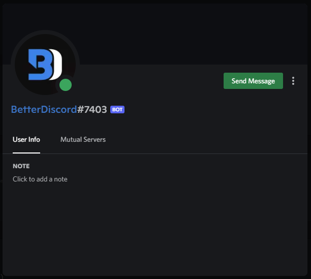
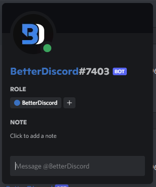
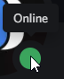
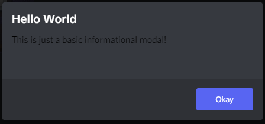
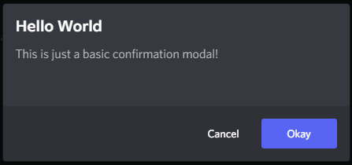
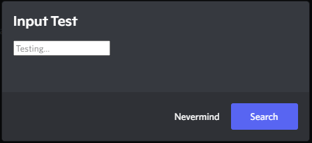
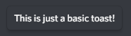
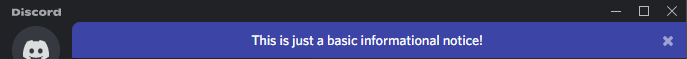
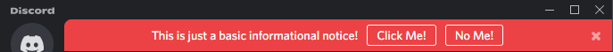

import Tabs from '@theme/Tabs';
import TabItem from '@theme/TabItem';

# UI Components

## Terminology

All of the following terms are important to know, they'll be used often both by Discord's internals and by fellow developers as you start engage with the community. The first three are generally used terms for web development. After that, they are either Discord-specific or BetterDiscord-specific.

### Modal

Modals are elements that overlay the main screen in the center, usually darkening the rest of the page behind them. These are often used to get user input or display important information.

<details>
<summary>Example</summary>



</details>

### Popout

Popouts are similar to modals in that they overlay the main screen, however they almost never darken the page behind them, nor are they front-and-center. These usually stick near the user's mouse location and appear after a user input. They are great for displaying additional information to the user about something specific.

<details>
<summary>Example</summary>



</details>

### Tooltip

Tooltips are yet another overlay element. These are very similar to popouts but much much smaller and usually point to a specific element to indicate that it is giving additional information about it. This is used to make clean buttons or clarify text.

<details>
<summary>Example</summary>



</details>

### Notice

Notices are a Discord-specific term for a banner-like element that appears at the top of the screen. In Discord this is most often used to either give persistent information or passively wait for user interaction.

<details>
<summary>Example</summary>


</details>

### Toast

Toasts are a BetterDiscord-specific term for a small tooltip-like popup that appears at the bottom of the screen. This is borrowed from the Android ecosystem and was modeled after it. Toasts are used to indicate information to the user about either interaction or background tasks.

<details>
<summary>Example</summary>


</details>

## BdApi Helpers

There are some utility functions from `BdApi` that help you build and display certain UI elements. Using them instead of building your own saves you code and helps ensure a consistent UI/UX for the end user across plugins. While they may work for a large range of cases, for advanced UIs (and ones not handled in `BdApi`) you will need to build your own.

### alert

The `BdApi.alert()` method allows you to create and display a simple yet extensible informational modal. Its signature is `alert(title, content)`.

The most straightforward way to use it, is to just use strings.

<Tabs groupId="alert">
<TabItem value="code">

```js
BdApi.alert("Hello World", "This is just a basic informational modal!");
```

</TabItem>

<TabItem value="result">


</TabItem>
</Tabs>

You can also pass in a react element for `content` but <u>not for `title`</u>. However, this means you are on your own for functionality and styling. In the last example we saw that the `content` text was colored and themed properly. But let's try just wrapping a string in a react element.

<Tabs groupId="alert">
<TabItem value="code">

```jsx
BdApi.alert("Hello World", <div>This is just a basic informational modal!</div>);
```

</TabItem>

<TabItem value="result">



</TabItem>
</Tabs>

And since we are able to use react here for `content`, it also allows us to pass in a whole tree of elements or custom components. This allows for some very interesting alert possibilities.

<Tabs groupId="alert">
<TabItem value="code">

```jsx
function MySearchInput(props) {
    return <input
                type="text"
                placeholder={props.placeholder || "Search..."}
                onChange={props?.onChange}
            />;
}

BdApi.alert(
    "Input Test",
    <MySearchInput
        placeholder="Testing..."
        onChange={event => console.log(event)}
    />
);
```

</TabItem>

<TabItem value="result">


</TabItem>

<TabItem value="console">


</TabItem>
</Tabs>

Important to note for later that `alert` returns a unique modal ID used internally by Discord. We won't be going over its usage here--it's safe to ignore--but may be covered by advanced guides.


### showConfirmationModal

Under the covers, `alert` makes use of `showConfirmationModal`. This one is an even more extensible and useful helper function. Similar to `alert` this has a `title` and `content` parameter that accept the same types as before. It's full signature is `showConfirmationModal(title, content, options = {})`. For a full list of options check the [api reference](/api). We'll be going over some of the more useful ones here.

<Tabs groupId="showConfirmationModal">
<TabItem value="code">

```js
BdApi.showConfirmationModal("Hello World", "This is just a basic confirmation modal!");
```

</TabItem>

<TabItem value="result">



</TabItem>
</Tabs>

Looking at the result of this one, we can see there is an additional "cancel" button. We can change the text of both of those buttons as well as respond to either of them being clicked using the `options` in this example.

<Tabs groupId="showConfirmationModal">
<TabItem value="code">

```jsx
function MySearchInput(props) {
    return <input
                type="text"
                placeholder={props.placeholder || "Search..."}
                onChange={props?.onChange}
            />;
}

BdApi.showConfirmationModal(
    "Input Test",
    <MySearchInput
        placeholder="Find..."
        onChange={event => console.log(event)}
    />,
    {
        confirmText: "Search",
        cancelText: "Nevermind",
        onConfirm: () => console.log("Pressed 'Search'"),
        onCancel: () => console.log("Pressed 'Nevermind' or escape")
    }
);
```

</TabItem>

<TabItem value="result">



</TabItem>
</Tabs>

Here clicking `Search` will close the modal and call the `onConfirm` function we passed. Similarly clicking `Nevermind` will call `onCancel`. If the user exits the modal either by pressing `escape` on their keyboard or by clicking outside of the modal on the dark background, `onCancel` will also be called in this case.

Much like `alert` the function returns a unique modal ID.

### showToast

Since toasts are meant to be simple and straightforward messages to the user, making and showing a toast is just the same. The signature is `showNotice(content, options = {})`. But unlike with the modals, `content` can <u>only be a string</u>. And it's safe to ignore the options and still successfully show a fully styled toast. We'll go over the useful ones here, but be sure to check the api reference for a full listing of options.

<Tabs groupId="showToast">
<TabItem value="code">

```js
BdApi.showToast("This is just a basic toast!");
```

</TabItem>

<TabItem value="result">



</TabItem>
</Tabs>

The most important and frequently used option is `type`. This allows a full styling of different toasts complete with icons for different situations. This is defaulted to an empty string, resulting in the image above. The other options are shown below:

<Tabs>
<TabItem value="info">


</TabItem>

<TabItem value="success">


</TabItem>

<TabItem value="warning">


</TabItem>

<TabItem value="error">


</TabItem>
</Tabs>

The toasts, much like on Android, disappear after a set time. By default, this is in 3 seconds. You can change this using the `timeout` option which takes a number of milliseconds to show the toast before it disappears. This function does not return anything.

### showNotice

This function has the same signature as `showToast` with the except that `content` can also be an `HTMLElement`. This allows it to be a bit more customizable. However, most of the functionality you would need is included already.

<Tabs groupId="showNotice">
<TabItem value="code">

```js
BdApi.showNotice("This is just a basic informational notice!");
```

</TabItem>

<TabItem value="result">



</TabItem>
</Tabs>

They can do more than just show information though, you can also add multiple buttons for the user to interact with.

<Tabs groupId="showNotice">
<TabItem value="code">

```js
BdApi.showNotice(
    "This is just a basic informational notice!",
    {
        type: "error",
        buttons: [
            {
                label: "Click Me!",
                onClick: () => console.log("Clicked Me")
            },
            {
                label: "No Me!",
                onClick: () => console.log("Wrong One!")
            }
        ]
    }
);
```

</TabItem>

<TabItem value="result">



</TabItem>
</Tabs>

Notice how this time we used `type: "error"` and it became red. This has the same `type` and styling options as [showToast](#showtoast).

Each of the buttons here act completely independently which allows for powerful combinations. Additionally, you can have the notice close after a set time using `timeout`. This is a number of milliseconds after which to close the notice. If set to 0 (the default), it won't close until closed by the user or the caller.

`showNotice` returns a function which allows the original caller to close the notice either earlier than the timeout or without user interaction. The `onClick` of the button is provided with this same function as the only argument.