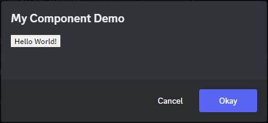
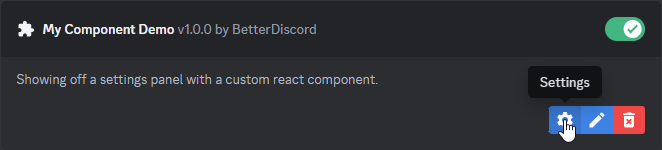
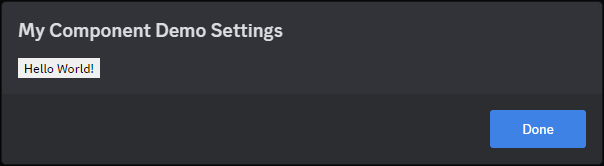

# React

::: tip

This is not a tutorial on React in general, just on using it in Discord and BetterDiscord. For general React learning and documentation check out [React.dev](https://react.dev/learn).

:::


Since Discord itself is made using React, it's really easy to make use of within a plugin. It's also very convenient for [React Injection](../advanced/react.md) which we'll get to later on.

One thing to keep in mind going forward: without [bundling](./bundling.md), you cannot use JSX style react components in a plugin. For that reason, this section will be done without any JSX.

## The Basics

BetterDiscord provides both the `React` and `ReactDOM` globals on the `BdApi` object. This gives you access to make functional components, make class-based components, or even render into an existing DOM node. Take a look at the example below to get an idea of how it might work in your own plugin.

::: code-group
```js:line-numbers [Class]
class MyComponent extends BdApi.React.Component {
  render() {
    return BdApi.React.createElement("div", {className: "my-component"}, "Hello World!");
  }
}
```

```jsx:line-numbers [Functional]
function MyComponent() {
  return BdApi.React.createElement("div", {className: "my-component"}, "Hello World!");
}
```
:::


Using hooks for functional components and state in class-based components also work just fine.

::: code-group
```js:line-numbers [Class]
class MyComponent extends BdApi.React.Component {
  constructor(props) {
    this.state = {disabled: props.disabled ?? false};
  }
  render() {
    return BdApi.React.createElement("button", {className: "my-component", disabled: this.state.disabled}, "Hello World!");
  }
}
```

```jsx:line-numbers [Functional]
function MyComponent({disabled = false}) {
  const [isDisabled, setDisabled] = BdApi.React.useState(disabled);
  return BdApi.React.createElement("button", {className: "my-component", disabled: isDisabled}, "Hello World!");
}
```
:::


If you think that repeating `BdApi.React` over and over is a bit tedious, many developers alias it in their own plugins with a simple `const R = BdApi.React;` or even `const ce = BdApi.React.createElement;`. Those that don't tend to use JSX and bundling which we'll get to in the next chapter.


## React in BetterDiscord

Some of the [UI related functions](../../api/ui.md) of BetterDiscord accept React Components as options to be rendered. Some accept React Nodes/Elements which is just having already called `createElement`. One good example is the confirmation modal. It's already a very helpful utility, but adding in your own custom React component allows for some very powerful UI and UX for end users. Just as a quick example, take a look at how we can combine our `MyComponent` from before with the confirmation modal.

```js
BdApi.showConfirmationModal("My Component Demo", BdApi.React.createElement(MyComponent));
```

And here's how it looks.



How you use it is entirely up to you! You can put anything in these modals from something as simple as text information, to full blown settings panels.

Speaking of settings panels, you might recall from [Plugin Structure](../introduction/structure.md) that plugins can have a `getSettingsPanel()` that return a React component. Look at this sample plugin below for a short example.

```js:line-numbers [MyComponentDemo.plugin.js]
/**
 * @name My Component Demo
 * @description Showing off a settings panel with a custom react component.
 * @version 1.0.0
 * @author BetterDiscord
 */

function MyComponent({disabled = false}) {
  const [isDisabled, setDisabled] = BdApi.React.useState(disabled);
  return BdApi.React.createElement("button", {className: "my-component", disabled: isDisabled}, "Hello World!");
}

module.exports = class test { 
  start() {}
  stop() {}

  getSettingsPanel() {
    return MyComponent;
  }
}
```

Your plugin will show that it has a settings panel.



And clicking on it shows our new settings panel!



It may not be the best settings panel, but it's certainly a start.


## React in Discord

If you already know React, then this will section will be pretty obvious. In order to render your React component inside of Discord, first add your own `HTMLElement` somewhere.

```js
const element = BdApi.DOM.parseHTML("<div>");
const target = document.querySelector(".container-YkUktl");
target.append(element);
```

Then just render your element from the previous section into that DOM node.

```js
BdApi.ReactDOM.render(BdApi.React.createElement(MyComponent), element);
```

If you're following this tutorial, you'll see a little button appear down next to the settings cog at the bottom left of the client. When you're done with your component, be sure to unmount it.

```js
BdApi.ReactDOM.unmountComponentAtNode(element);
```

And your button will be gone!

One thing to keep in mind, because Discord is constantly changing elements around, if your element gets removed from the `document`, you should unmount your component. Otherwise, you'll end up with a memory leak. You'll also still be trying to use UI that isn't even visible to the user. You can combine the `unmountComponentAtNode` function with the `MutationObserver` from [Using the DOM](../basics/dom.md) to automatically unmount whenever your element is removed from the `document`.

Lastly, while this does render React inside the Discord client, it doesn't actually render as part of Discord's React tree. This might seem inconsequential, but it can be the difference between things working and not. If you're re-using internal Discord components, especially components involving popouts and tooltips, they won't work outside of Discord's tree. If you're interested in rendering inside of Discord's React tree, you'll learn more in the [React Injection](../advanced/react.md) later on.
