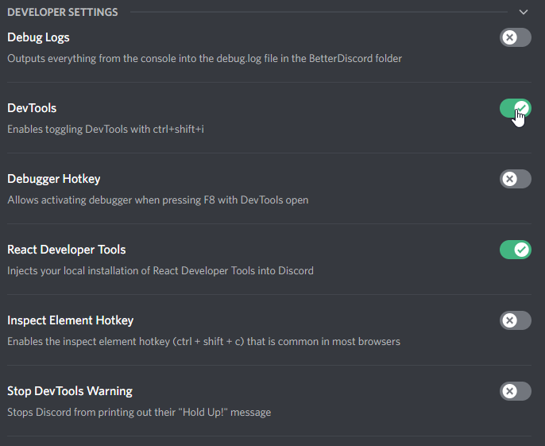
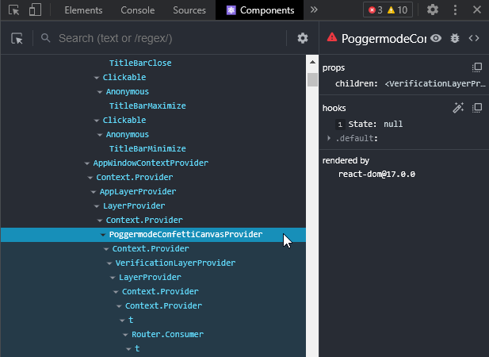
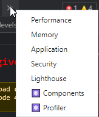

# Developer Tools

These are tools that help with both general web development, and working with the React UI library. 

### Chromium DevTools

If you have past web development experience you are probably already familiar with the Chrome/Chromium DevTools. If not, it might be a good idea to give [its documentation](https://developer.chrome.com/docs/devtools/) a once-over.

Working in this Discord (and BetterDiscord) environment, we have access to these DevTools. Discord has this disabled by default, but it is possible to reenable this functionality in the BetterDiscord settings. Go to the BetterDiscord Settings page and find the Developer Settings. Then check the option for DevTools.

Once this is enabled, you can press `ctrl`+`shift`+`i` (or for a Mac `cmd`+`opt`+`i`) to open the DevTools just as you would in Chrome.

### React Developer Tools

If you have past web development experience but not a lot of React experience, it might be a good idea to give [its documentation](https://reactjs.org/tutorial/tutorial.html) a once-over. It also may be worth taking a look through [the tutorial](https://react-devtools-tutorial.vercel.app/) for the React DevTools.

Since this environment is one with Chromium DevTools, we can add extensions meant for those DevTools. Unfortunately, this is not packaged with Discord or BetterDiscord, but BetterDiscord can add the React DevTools for you if you have it installed locally. That is, BetterDiscord looks for a local Chrome installation with the React Developer Tools extension installed and loads the extension from there.

So to get this setup, make sure you have Chrome installed (most people usually do), and then head to the [React Developer Tools](https://chrome.google.com/webstore/detail/react-developer-tools/fmkadmapgofadopljbjfkapdkoienihi) extension page and install it like any other Chrome extension.

:::info

Tip: Power users can avoid installing Chrome by creating a matching set of directories and placing the extension there instead!

:::

With this installed, head back to the Developer Settings in BetterDiscord (the same from the [image above](#chromium-devtools)) and this time select the React DevTools option. BetterDiscord should then prompt you to restart.

After restarting, you can press `ctrl`+`shift`+`i` (or for a Mac `cmd`+`opt`+`i`) to open the DevTools and then find that the React DevTools tabs, `Components` and `Profiler` have been added.

If you don't see them there, be sure to check the tab overflow to see if they got added at the end of the list.

<!-- ## Development Environment

### IDE

### Build Tools -->