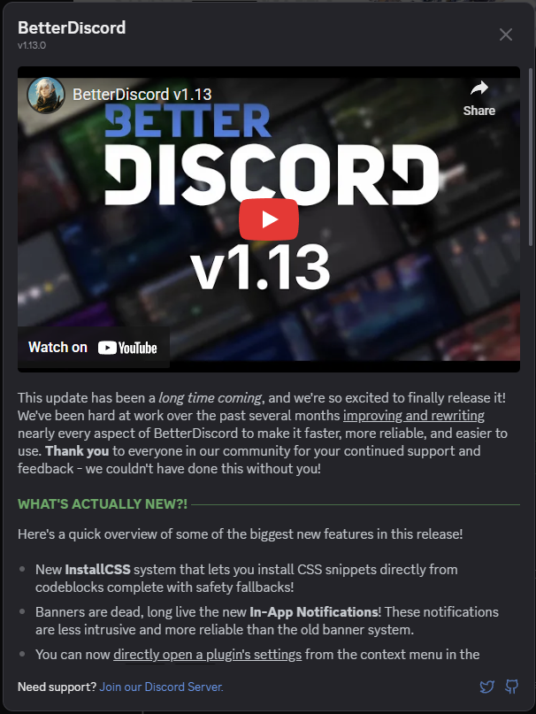

# Changelogs

Changelogs are a way to show users what's new or fixed with your plugin. This is a great way to let users know when you've fixed high priority items.



## Showing Changelogs

When you want to show the user that you've added some cool features or fixed some nasty bugs, this function can help you show it in a clean and consistent way.

```js
BdApi.UI.showChangelogModal({
    title: "My Plugin",
    subtitle: `version ${version}`,
    blurb: "A summary of this update",
    changes: [
        {
            title: "New Features",
            type: "added",
            blurb: "Summary of the new features",
            items: [
                "Added feature A!",
                "Refactored feature B into feature C!"
            ]
        },
        {
            title: "Bugs Eliminated",
            type: "fixed",
            items: [
                "No more corrupt settings.",
                "Clicking the button does stuff."
            ]
        }
    ]
});
```

You can check the [api reference](/api/classes/UI.md#showchangelogmodal) for more details, but this little snippet shows the most important features. Notably, this changelog api can also allow you to display a banner image, a youtube video, or a direct video above all of the text. This can be useful when you need to add a showcase of new things or if you just want to have a consistent branding. There are also 4 change "types". In the snippet we see fixed and added, there are also improved and progress.

For now, plugins will have to decide when to display the changelog modal, though it is planned to be more automated in a future BetterDiscord update. For an example of how to do this check out this [Demo Plugin](https://gist.github.com/zerebos/b13adc05f22df008ee5d0411d9d18ff0) featuring the new APIs for BetterDiscord v1.11.0.
