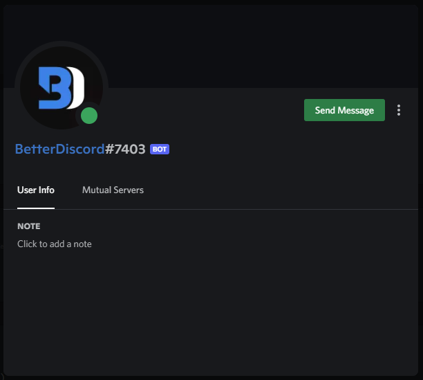
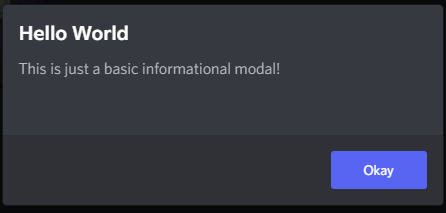
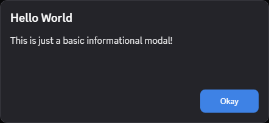
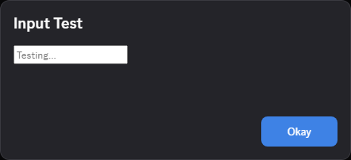
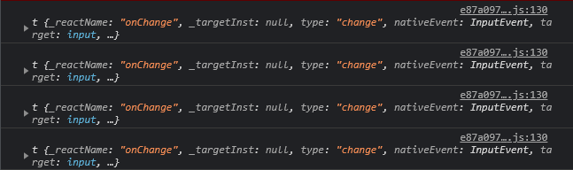
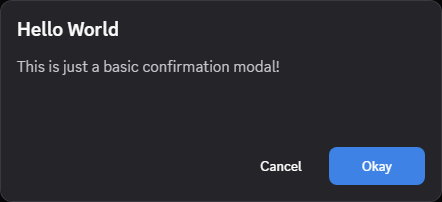
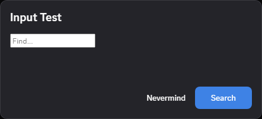
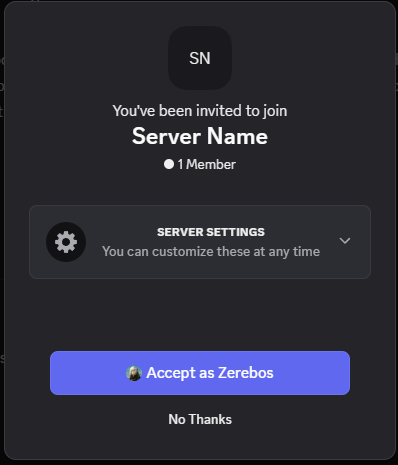

# Modals

Modals are elements that overlay the main screen in the center, usually darkening the rest of the page behind them. These are often used to get user input or display important information.



## Basic Modals

The `BdApi.UI.alert()` method allows you to create and display a simple yet extensible informational modal. Its signature is `alert(title, content)`.

The most straightforward way to use it, is to just use strings.


```js
BdApi.UI.alert("Hello World", "This is just a basic informational modal!");
```
::: details Result

:::


You can also pass in a react element for `content` but <u>not for `title`</u>. However, this means you are on your own for functionality and styling. In the last example we saw that the `content` text was colored and themed properly. But let's try just wrapping a string in a react element.


```jsx
BdApi.UI.alert("Hello World", <div>This is just a basic informational modal!</div>);
```

::: details Result

:::

And since we are able to use react here for `content`, it also allows us to pass in a whole tree of elements or custom components. This allows for some very interesting alert possibilities.


```jsx
function MySearchInput(props) {
    return <input
                type="text"
                placeholder={props.placeholder || "Search..."}
                onChange={props?.onChange}
            />;
}

BdApi.UI.alert(
    "Input Test",
    <MySearchInput
        placeholder="Testing..."
        onChange={event => console.log(event)}
    />
);
```

::: details Result

:::

::: details Console

:::

Important to note for later that `alert` returns a unique modal ID used internally by Discord. We won't be going over its usage here--it's safe to ignore--but may be covered by advanced guides.

## Confirmation Modals

Under the covers, `alert` makes use of `showConfirmationModal`. This one is an even more extensible and useful helper function. Similar to `alert` this has a `title` and `content` parameter that accept the same types as before. It's full signature is `showConfirmationModal(title, content, options = {})`. For a full list of options check the [api reference](/api/). We'll be going over some of the more useful ones here.


```js
BdApi.UI.showConfirmationModal("Hello World", "This is just a basic confirmation modal!");
```

::: details Result

:::


Looking at the result of this one, we can see there is an additional "cancel" button. We can change the text of both of those buttons as well as respond to either of them being clicked using the `options` in this example.

```jsx
function MySearchInput(props) {
    return <input
                type="text"
                placeholder={props.placeholder || "Search..."}
                onChange={props?.onChange}
            />;
}

BdApi.UI.showConfirmationModal(
    "Input Test",
    <MySearchInput
        placeholder="Find..."
        onChange={event => console.log(event)}
    />,
    {
        confirmText: "Search",
        cancelText: "Nevermind",
        onConfirm: () => console.log("Pressed 'Search'"),
        onCancel: () => console.log("Pressed 'Nevermind' or escape")
    }
);
```

::: details Result

:::

Here clicking `Search` will close the modal and call the `onConfirm` function we passed. Similarly clicking `Nevermind` will call `onCancel`. If the user exits the modal either by pressing `escape` on their keyboard or by clicking outside of the modal on the dark background, `onCancel` will also be called in this case.

Much like `alert` the function returns a unique modal ID.

## Invite Modals

BetterDiscord provides an easy API for opening Discord's native invite modal using normal invite codes.

```js
BdApi.UI.showInviteModal("XXXXXX")
```

