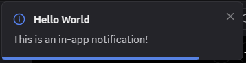

# Notifications

Notifications in this context are in-app notifications that sit above the rest of the UI. This differs from native notifications that can appear over your entire desktop. These in-app notifications are also much more versatile as they can have different colors, content, action buttons, and more!



## Creating Notifications

One of the simplest examples is the notification above. It can be created with a single simple call to the BetterDiscord api.

```js
BdApi.UI.showNotification({
    title: "Hello World",
    content: "This is an in-app notification!"
});
```

<!-- TODO: showcase buttons, onClick/onClose, color/types, duration, icon -->