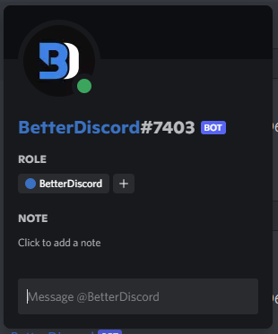

# Popouts

Popouts are similar to modals in that they overlay the main screen, however they almost never darken the page behind them, nor are they front-and-center. These usually stick near the user's mouse location and appear after a user input. They are great for displaying additional information to the user about something specific.

