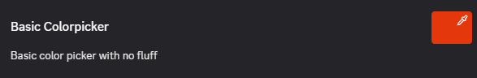
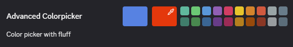

# Color

The color picker input is surprisingly easy to use. For a simple use-case you only need the following data in addition to the setting item data:

```ts
const ColorInput = {
    type: "color",
    value: "#ff0000",
}
```

That's enough to give you the following color input:



## Advanced

But the color picker can be made to look a lot more like Discord's. You can add a default color fallback that is a second large square the user can click on to easily go back to the default value. You can also provide a list of colors as part of the palette much like Discord's color picker in the role settings.

```ts
const ColorInputAdvanced = {
    defaultValue: "#ffffff",
    colors: ["#0000ff", "#00ff00", "#ff0000"],
}
```

When fully configured you get a very fancy color input.



## Acceptable Values

Colors can either be a numerical value representing the color or a hex string, the latter of which is demonstrated above. The numerical value is common inside Discord's internal code so it is interesting to know about this format. The numerical values are just the literal conversion from the hex value in the hex string to base 10 decimal.
