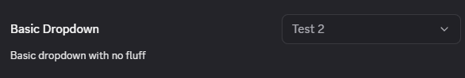
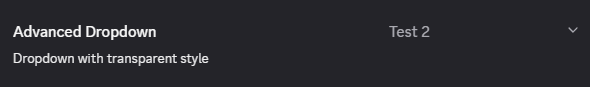

# Dropdown

The dropdown input does not require much beyond the typical setting item data:

```ts
const Dropdown = {
    type: "dropdown",
    value: "arbitrary",
    options: [
        {label: "Test 1", value: 50},
        {label: "Test 2", value: "arbitrary"},
        {label: "Final Test", value: {label: "Test 1", value: 50}}
    ]
}
```

That's enough to give you the following color input:



A key feature here is that the label does not need to match the value or even be of the same type.

## Advanced

The dropdown does not really have any advanced features, the only additional option is to make it a transparent style which is useful for contexts other than settings.

```ts
const DropdownAdvanced = {
    style: "transparent"
}
```



## Acceptable Values

Dropdown option value can be of any type including objects as shown in the examples above. The component will return to you exactly what was given for that option.
