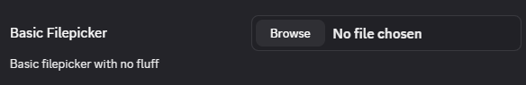
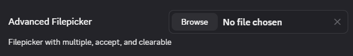

# File

The basic file picker requires nothing other than the `type` of `"file"`.



You get back a path to the file chosen.

## Advanced

The file picker has a number of options available including the native file input options like `accept` and `multiple`. BetterDiscord adds a `clearable` which is shown below.

```ts
const FileAdvanced = {
    multiple: true,
    clearable: true,
    accept: "image/*"
}
```


