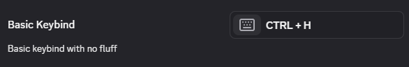
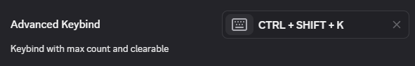

# Keybind

The keybind input works based on the names of keys and can started with a simple set of keys.

```ts
const Keybind = {
    type: "keybind",
    value: ["Control", "H"]
}
```



The input returns an array much like the input seen here.

## Advanced

The keybind input can be optionally clearable and optionally have a maximum number of keys in a keybind.

```ts
const KeybindAdvanced = {
    max: 5,
    clearable: true
}
```


