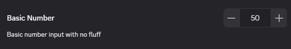
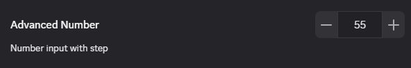

# Number

The number input is very simple and straightforward for the majority of cases.

```ts
const Number = {
    type: "number",
    value: 50
}
```



## Advanced

The number input can also have minimum and maximum limits as well as an enforced step.

```ts
const NumberAdvanced = {
    min: 10,
    max: 100,
    step: 5
}
```


