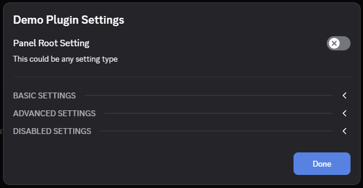

# Overview

::: tip
It's recommended that you read the [related tutorial](../../tutorials/settings.md#panel-builder) before proceeding!
:::

BetterDiscord provides a convenient suite of setting types either via a JSON-like API or via direct React Component usage. That said, do keep in mind that you <u>are not limited</u> to these built-in settings types or even the format. Even the JSON-like API provides a way to use it hybrid with custom components for advanced users. These APIs simply act as a convenient way for plugin developers to quickly scaffold Discord-like settings panels consistently. These APIs and components are stable since they are created by BetterDiscord entirely and are not a wrapper around Discord's internal components.

## Demo

If you want a quick Demo of all the settings components currently available through BetterDiscord, download and test this [Demo Plugin](https://gist.githubusercontent.com/zerebos/b13adc05f22df008ee5d0411d9d18ff0/raw/46f4c64a45090f80cf7042851ef59fd3d5603a69/DemoPlugin.plugin.js) that showcases just about every variant possible including disabled variants.

After installing the plugin, go ahead and enable it then open its settings. You'll be greeted with the following modal.



You can then click through and test out the various settings and get a feel for what's possible using the built-in APIs.

## Concepts

As mentioned above, BetterDiscord provides two high level ways of making use of these components. Using the React Components directly gives you more control and customization, but it also means it has fewer conveniences and helpers built-in. The documentation here will focus on the JSON-like API since that's our own custom API while React Components are pretty standard. You'll find a lot more information on the component details in the [API reference](../../../api/classes/Components.md).

For our JSON-like API we have 4 main components to consider, and it's important to know how they tie into one another. Let's start from the smallest consumable component and zoom out from there.

### Setting Input

There are many different setting inputs that you'll explore in the next chapters in more detail. But in this context setting input basically means the input UI being shown and the data being collected. For example, a Color setting input will likely show some sort of color picker and collect a string representing that color. You'll notice there was no mention of a setting name. That's what comes next.

### Setting Item

A Setting Item is what holds a setting type within it. You've probably seen in the demo or in Discord's own settings that typical layout of setting name with description below it and the input on the right-hand side. This whole unit is called a setting item. It can have a name, description, and additional metadata like if the input should be inline on the right-hand side or displayed after the description. It is otherwise agnostic of the specific setting input being used.

### Setting Group

Setting Groups are just a list of setting items with some additional UI. If you take a look at the demo above, each of those collapsible sections is a settings group. This is a good way to help organize an otherwise long and unruly setting list.

### Settings Panel

This is the highest level component, and it acts as the wrapper to all of your settings UI. It is a pretty generic component that allows for plenty of customization including custom components.

## Usage

Our JSON-like API is meant to be a convenient alternative to manually provisioning each individual component. So for that reason at this time we only provide two high level APIs.

### `buildSettingItem()`

As you might imagine, this allows you to build a Setting Item complete with a setting input. In most cases you'll tell it a specific `type` of input to use which will cause it to use one of the built-in setting input components. For advanced users you can also use a `type` of `custom` and provide a `children` render function. This gives you a way to still use the convenience of the JSON-like API while allowing for the flexibility of custom components. More details on the individual input types will be in the next sections of the documentation.

Here is what is expected from this API for all settings types:

```ts
interface SettingItem {
    type: SettingType;
    id: string;
    value: unknown;
    name?: string;
    note?: string;
    disabled?: boolean;
    defaultValue?: unknown;
    inline?: boolean;
    hidden?: boolean;
    onChange(v: unknown)?: void;
}
```

As you'll notice, most of these are optional, and they should all be understandable from name alone. The only one that might be a bit confusing is `id`. BetterDiscord uses this `id` to help keep all of your settings separate and give you an identifier to use when settings change. This isn't as important when doing single Setting Items, but when you create an entire panel at once, it's nice to know where the change is coming from. You'll see more on that in the next section.

Each `SettingType` will require some other properties as well as providing other options. Visit those pages in the documentation for additional details or take a look at the [API reference](../../../api/classes/UI.md#buildsettingitem).

### `buildSettingsPanel()`

This is a more complicated API that allows for grouping and control over your display of your settings. In this API you have access to a new `type` called `category` that has a list of `settings`.

```ts
interface SettingGroup {
    id?: string;
    name?: string;
    button?: object;
    shown?: boolean;
    showDivider?: boolean;
    collapsible?: boolean;
    onDrawerToggle?(state?: boolean): void;
    onChange?(categoryId: string, settingId: string, value: any): void;
    onChange?(settingId: string, value: any): void;
    settings: SettingItem[];
};
```

Here you'll notice that the `id` and `onChange` properties are different than you might have expected. They are actually tied together. The `onChange` fires for all child settings that don't have an `onChange` of their own. The `onChange` for the group is given the `id` of the child setting as well as the updated `value`. If you provide a group `id` then the group `onChange` gets the group `id`, the setting `id` as well as the new `value`. This can be a bit confusing, but it's a very powerful wrapper that allows you to prevent collisions of `id`s while still keeping things simple.

This `onChange` is also carried to the top of Settings Panel.

```ts
interface SettingsPanel {
  getDrawerState?: (categoryId: string, defaultShown: boolean) => boolean;
  onChange: (categoryId: string | null, settingId: string, value: any) => void;
  onDrawerToggle?: (categoryId: string, shown: boolean) => void;
  settings: Setting[];
}
```

You'll notice that SettingsPanel has an `onChange` that listens to all settings that don't have an individual `onChange` attached to them. This means you can use a single listener for your entire panel using `id`s to differentiate them. This is actually a very common pattern across plugins as it simplifies the listener setup.

The `getDrawerState` and `onDrawerToggle` are fired when opening and closing a setting group. This is entirely optional, and its intended use is to save/load the collapsed state of the groups. It's a small quality-of-life feature that users enjoy. BetterDiscord uses this very same API for its own settings.

The return value of `buildSettingsPanel()` can be returned directly to the plugin's `getSettingsPanel()` function that BetterDiscord uses to get your panel. You can see that in the demo plugin above. But in addition to being able to add custom individual items within the panel, you can technically take this return value of a rendered component and modify it as you see fit. You can even make it only a single part of your settings panel.

This JSON-like API is very convenient and opinionated, but it also has enough flexibility and customization to be helpful to power users. In the next sections you'll see the individual details of the different settings inputs you can use with this API.
