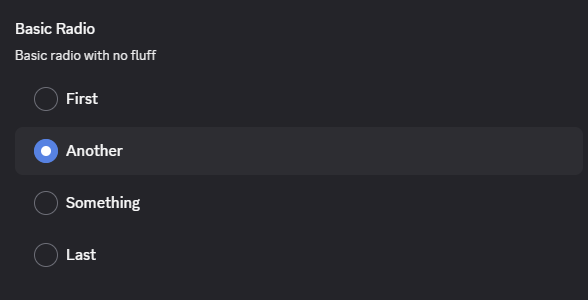
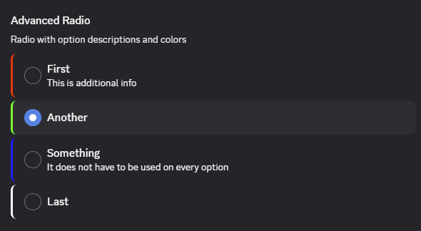

# Radio

The radio input is very similar to the [dropdown](./dropdown.md) especially for simple use-cases.

```ts
const Radio = {
    type: "radio",
    value: "test",
    options: [
        {name: "First", value: 33},
        {name: "Another", value: "test"},
        {name: "Something", value: 66},
        {name: "Last", value: "last"}
    ]
}
```



A key feature here is that the label does not need to match the value or even be of the same type.

## Advanced

The radio input itself does not have advanced options, but the individual options do. They can add both a color and description optionally.

```ts
const RadioAdvanced = {
    options: [
        {name: "First", value: 33, description: "This is additional info", color: "#ff0000"},
        {name: "Another", value: "test", color: "#00ff00"},
        {name: "Something", value: 66, description: "It does not have to be used on every option", color: "#0000ff"},
        {name: "Last", value: "last", color: "#ffffff"}
    ]
}
```


