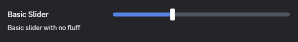
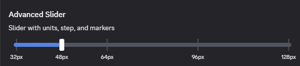

# Slider

The slider input is very simple and straightforward for the majority of cases.

```ts
const Slider = {
    type: "slider",
    value: 30,
    min: 20,
    max: 50,
}
```



## Advanced

The slider input is one of the more customizable components in our system. This can optionally be not-inline which is helpful for larger sliders. It also supports a units label as well as custom markers.

```ts
const SliderAdvanced = {
    units: "px",
    markers: [32, 48, 64, 96, 128],
    inline: false
}
```


