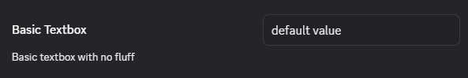
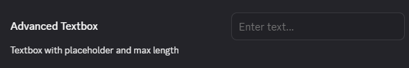

# Text

The text input requires nothing other than the `type` of `"text"` along with the `value` of course.

```ts
const Text = {
    type: "text",
    value: "default value",
}
```



## Advanced

The text input can have a `placeholder` that shows when there is no text, and you can also enforce a `maxLength`.

```ts
const TextAdvanced = {
    placeholder: "Enter text...",
    maxLength: 6,
}
```


