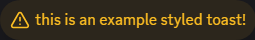
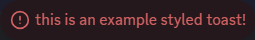

# Toasts

Toasts are a BetterDiscord-specific term for a small tooltip-like popup that appears at the bottom of the screen. This is borrowed from the Android ecosystem and was modeled after it. Toasts are used to indicate information to the user about either interaction or background tasks.


## Showing Toasts

Since toasts are meant to be simple and straightforward messages to the user, making and showing a toast is just the same. The signature is `showNotice(content, options = {})`. But unlike with the modals, `content` can <u>only be a string</u>. And it's safe to ignore the options and still successfully show a fully styled toast. We'll go over the useful ones here, but be sure to check the api reference for a full listing of options.


```js
BdApi.UI.showToast("This is just a basic toast!");
```

::: details Result

:::

The most important and frequently used option is `type`. This allows a full styling of different toasts complete with icons for different situations. This is defaulted to an empty string, resulting in the image above. The other options are shown below:

::: details Info

:::

::: details Success

:::

::: details Warning

:::

::: details Error

:::

The toasts, much like on Android, disappear after a set time. By default, this is in 3 seconds. You can change this using the `timeout` option which takes a number of milliseconds to show the toast before it disappears. This function does not return anything.
