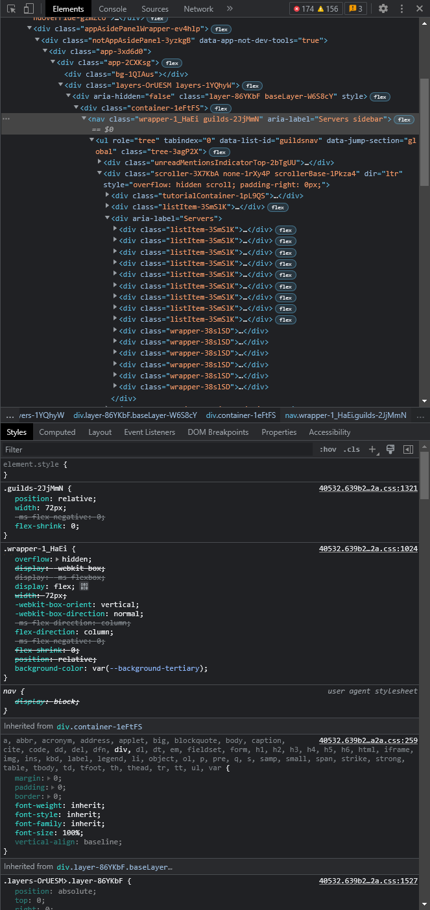

# Creating A Theme

::: tip

If you're just starting out with CSS, consider a more in-depth tutorial like the one from [MDN](https://developer.mozilla.org/en-US/docs/Learn/Getting_started_with_the_web/CSS_basics). This guide is meant for those with some experience with CSS.

:::

Let's start with the premise that we want to make Discord look more like [Visual Studio Code](https://code.visualstudio.com/), a popular editor used by millions of developers. This covers our design (mostly) since we have a point of reference for the general design, layout, usability, color scheme, and even icons! That doesn't mean we have to make use of them all, but that's the best way to emulate another program via a theme.

## Analysis

Since we're using VSCode as our point of reference, it's a good idea to work out how to map one UI to the other. With VSCode, it's not too difficult. There's the controls on the left panel which is narrow, just like the guild list. We can map those together. The `Explorer` pane of VSCode roughly lines up with where the channel list, dm list, and account container are in Discord. The main editor panel can map to the general chat area, while the terminal at the bottom can map to the textarea. But what do we do about the member list on the right? There is no default right-hand panel in VSCode. But the color scheme and layout of the member list is roughly the same as the channel list, so we can map that to the `Explorer` pane as well and make the interface somewhat symmetrical.

## Implementing

Just like how we recommended in [the last section](./process.md#code-structure--strategy), let's start with the guild list and see how easy or difficult it can be to replicate the vibe of VSCode. Let's start with our theme file.

```js [MyTheme.theme.css]
/**
 * @name MyTheme
 * @author YourName
 * @description Describe the aesthetic. Maybe a support server link.
 * @version 0.0.1
 */
```

We actually don't need more than that to be a valid theme file for BetterDiscord to load. Go ahead and save that in the `themes` folder and open it up in your favorite editor. Now go back to Discord and enable your theme in BetterDiscord settings. Now, on every save, BetterDiscord will automatically reload your theme so you can see your changes as you go.

Let's get back to the guild list. The first step to theming it is to understand its `html` structure and its styles. Open up DevTools and try to select the guild list. You might not end up with exactly the right element we're looking for but that's okay, take a look below for what we should start with.

::: details Guild List in DevTools



:::

But you might be asking, why that element specifically? We select this element, because it's the highest element in the DOM tree without going into a shared container. That is to say, if you select the next ancestor in the DOM tree you'll see that it suddenly includes the chat, channel, and member list. Since we're targeting the guild list, this is our starting point. We can always traverse down the tree as needed.

Looking at this element however, we can see that the background for the guild list is being set on this element. Check the `Styles` panel in the screenshot above. We can see it's being set to a variable called `--background-tertiary`. So we have two options, override the background for this element, or set this Discord variable to our value. Let's try for the latter and add this to our theme:

```css
:root {
    --background-tertiary: #333333;
}
```

The `#333333` comes from the corresponding VSCode panel. If you save your theme, you'll suddenly see that the guild list has changed color to match VSCode. Moreover, you might see some other colors have changed too, like the titlebar on windows, and the background of the search bar.

Next, let's see if we can make the guild list even narrower. The bar in VSCode is about `50px` wide. 

```css
.guilds-2JjMmN {
    width: 50px;
}
```

Save once again and you'll see that the guild list shrunk as expected! But, the guilds didn't shrink with it and they got cut off. This is where theming in BetterDiscord differentiates from typical web development, traversing the DOM tree to find out what else has to be overridden to actually do what you want. Let's do that together! Checking each node as we go, the first one we see that sets its own width has the selector `.listItem-3SmSlK` which sets it to `72px`. Let's go ahead and change that to `50px` as well.

```css
.guilds-2JjMmN,
.listItem-3SmSlK {
  width: 50px;
}
```

You'll see that while the guilds don't exactly shrink, they are no longer cut off. Except of course for the background of an open server folder, for reasons we not yet know. Let's go back to traversing the tree and see what else is setting a size directly. It seems that the selector `wrapper-2PSQCG` which is found under one of the `listItem-`s from before sets both `height` and `width` to `48px`. It's clear this needs to change but not necessarily to what. We can always try calculating it based on proportions. If the width of the container was `72px` before and the width of the guild element was `48px` before, that means the guild took up `66.6667%` or `2/3` of the width before. We can now calculate a new width with our given `50px` container size. This gives us a guild width of `33.33333px`. As we know, rendering issues can occur with non-whole numbers so lets round down to `33px` and see how it feels.

```css
.wrapper-2PSQCG {
  width: 33px;
  height: 33px;
}
```

Well that didn't work. Let's check what went wrong. Immediately we see the next child `svg-2ifYOU` also sets the same `48px`. Add it to the selector!

```css
.wrapper-2PSQCG,
.svg-2ifYOU {
  width: 33px;
  height: 33px;
}
```

Wow what a difference that makes! The guild list suddenly looks and feels a lot different from where we started and we've barely done anything. There's still that issue with the expanded folder backgrounds, so let's select that element and see what's going on.

Ah looks like another `48px`, we can easily change that to `33px` to match. But what about `left`? Since that's an alignment, we'll have to scale that too. `12px` is `16.6667%` of `72px` so that's `8.333px` for our size, and we'll round down again to `8px` and see if that's enough.


```css
.wrapper-2PSQCG,
.svg-2ifYOU {
  width: 33px;
  height: 33px;
}

.expandedFolderBackground-1kSAf6 {
  left: 8px;
  width: 33px;
}
```

Looks like that did the trick! We were able to completely change the vibe of the guild list very quickly and learn how to traverse the tree and spot where to make changes.


## Conclusion

You'll find that there are many little pieces like the expanded background all throughout Discord that require manual adjustments or overriding. And not everyone has the same process either, we've just demonstrated one possible approach here. The best way to learn is by doing, and the more you play around with modifying Discord the more comfortable you'll be making the changes necessary to implement your vision.