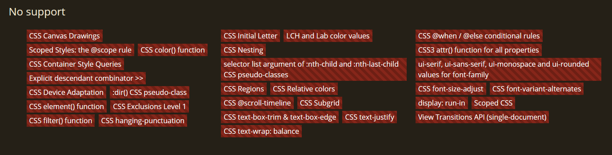

# Working With Selectors

## Background

There are many selectors that are helpful when developing your theme. But keep in mind, Discord is not using the bleeding edge versions of Chrome so not all of the very latest CSS selectors are supported. `:has` support was only recently added. The latest Chrome version in use as of writing is Chrome `108`. Here's what isn't supported at a brief glance.



You can view the list for yourself and click for details by checking out [CanIUse](https://caniuse.com/?compare=chrome+108&compareCats=CSS). They're a great resource to see what's supported in which browser, and you can even search by feature to see where it is and isn't supported.


## Specificity

We touched on this a bit in [The Creative Process](./process.md) section, but we'll talk about some of the more detailed information here.

### What is specificity?

Specificity determines what styles take precedence in order to style elements. It's like a race condition in traditional programming but in this case, instead of racing against another function over time, you're racing against another style over how specifically you are targeting a given element. The style with the *most* specific selector wins. Unless there is a tie, in which case the one that __appears later in the document__ wins. This is a specific wording, not to be confused with the idea that the one added latest-in-time to the page wins. But rather, the one appears last in the DOM tree of the `document`.

### Why do I need to know it?

The reason why we care about specificity so much in BetterDiscord themes is because we are theming an already existing application. In traditional web development, you own all of the CSS and you can control what selectors you are using and you can be careful about colliding selectors. In this environment, you are competing against Discord's styles for each and every element that exists in the page. And you control neither the HTML nor the CSS on the page. So (nearly) every single style you write will need a selector that is overriding another in some way. That is why we care so much about specificity.

### How can I use it?

Understanding the *how* of specificity is a very complex subject that browsers have to treat very carefully. This is out of scope for BetterDiscord's documentation, but if you are interested in how specificity is calculated, take a look at [MDN's article](https://developer.mozilla.org/en-US/docs/Web/CSS/Specificity) on the subject. It explains it much better than we ever could.

### Examples

Rather than worrying about exact specificity calculations, let's try out a few examples to see if we can understand it a bit more conceptually.

#### Setup

For these examples, reference this HTML:

```html:line-numbers
<div class="site-container">
  <main id="myContent">
    <h1>Text</h1>
  </main>
</div>
```

#### Descendants

Compare the two selectors below and check out the HTML. What color will the `Text` be?

```css:line-numbers
#myContent h1 {
  color: red;
}

.site-container #myContent h1 {
  color: blue;
}
```

If you said `blue` then you're correct. This is the more specific selector because it has more matching descendant selectors than the other.

#### Special Selectors

Now take a look at a slightly more complicated version. What's the new color of the `Text`?

```css:line-numbers
#myContent h1 {
  color: green;
}

[id="myContent"] h1 {
  color: yellow;
}

:where(#myContent) h1 {
  color: blue;
}
```

In this case, the answer is `green`. If you said `blue` thinking that the selectors were equal so the last one declared wins, that's good thinking but not quite right. These selectors are actually not quite equal. For the second selector, the attribute selector, you can consider this a "generalized" selector because it's really selecting through an attribute, and it can be any attribute. We just happened to pick `id` in this case. Comparatively, `#myContent` *directly* selects the element by id, so it has a higher specificity weight than an attribute selector even though it's checking `id`. As for the `:where()` selector, this is actually a special case. Using `:where()` allows you to be more selective in what you are targeting but is defined to have a specificity weight of `0`. Hence our text turning `green`.

It is worth noting that `:not()`, `:is()`, and `:has()` all also have a specificity weight of `0` **by themselves**. The selectors used inside the parentheses *do* have an effect on the specificity weight.

#### More Examples

You can see more examples on the [MDN page](https://developer.mozilla.org/en-US/docs/Web/CSS/Specificity#examples) mentioned before.


### Tips & Tricks

Some common methods to increase specificity often found in BetterDiscord themes:
 - Add a new descendant selector
 - Add multiple classes from the same element
 - Add `!important` (use with caution)
 - Add the HTML tag to the selector
 - Add duplicate selectors (e.g. change `#myContent` to `#myContent#myContent`)


## Selectors in Discord

There are some selectors, pseudo-selectors, and pseudo-classes that are used way more often in this environment than in classic web development. 

 - `:not()` is often used when classes are removed from elements rather than added
 - `:has()` is used to check descendant trees when elements lack important information
 - Attribute selectors used frequently for checking the state of inputs
   - They can also be used to be more tolerant of Discord's class changes
   - `:disabled` and `:checked` are also used for inputs
 - `:nth-child()` and `:nth-of-type` are used when a tree is lacking classes but the structure is stable
 - `:root` is used constantly for CSS variables

But remember, you are competing with Discord's styles so these selectors can get pretty crazy. Some styles are even inlined requiring the use of `!important`. Your best bet is to try out some of these selectors on the Discord client itself and experiment with what works and what doesn't. Another good idea is to look at existing themes and see how other developers tackle certain styles.