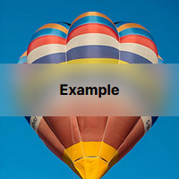

# Transparency

## General

Making the Discord client transparent enough to have a background can actually take a fair bit of work to do properly. There are many many elements with background colors that would obscure an applied background image. If you'd like to see some examples, there are plenty on the [BetterDiscord website](https://betterdiscord.app/themes).

## Desktop

If you want your theme to be transparent or transluscent to the desktop of your computer, it's very easy to support that. First, enable that option in BetterDiscord settings and restart. Then go to your theme and add

```css
:root {
    opacity: 0.5;
}
```

You'll see that suddenly you can partially see your desktop through the Discord client. The style above is just a quick-and-dirty way to show that it's actually working. It's better to properly integrate transparency into your theme. That can include things like having glassy effects on elements by adding a [backdrop-filter](https://developer.mozilla.org/en-US/docs/Web/CSS/backdrop-filter) with a blur. That gives you a cool effect.



You can also consider making just part of your theme see-through by keeping one section completely opaque. It adds an interesting dichotomy and a unique feel to your theme.

Note that using `backdrop-filter` above a transparent window will **not** blur anything behind it. It will only blur the elements within the Discord client itself, and on some platforms may leave some unpleasant rendering artifacts.

## Builder

If you really just want to make a theme where you have a background image, or to see through to your desktop, don't fire up your editor just yet. A community member has made a theme builder than can take existing BetterDiscord themes and customize them as you see fit, including adding background images or making them see-through to the desktop. For more information check out the website here: [https://bdeditor.dev/](https://bdeditor.dev/)