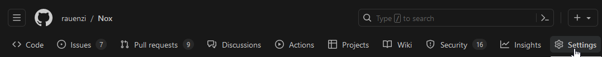
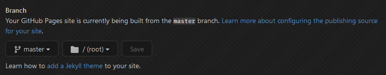
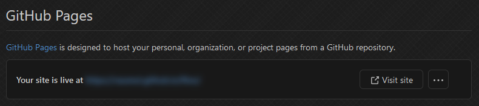

# Remote Imports

In this section we'll go over remote imports of resources and how you can even remotely import your own theme to let your theme update automatically for your users. With remote resourced, you need to ensure that the page serving your resource provides the correct [MIME type](https://developer.mozilla.org/en-US/docs/Glossary/MIME_type). If you're not sure, or don't what what that is, don't worry. We'll talk about it a bit below.

## Resources

You can use remote resources in your theme by making use of the `@import` directive normally in CSS. The only caveat here is that your `@import` needs to come *after* the meta comment in your theme but *before* everything else. If this is a resource you found from a 3rd-party like a CSS library or an icon pack, you can generally use whatever import they instruct in their documentation. That link will provide the right MIME type and automatically serve and update the content without you having to do anything else.

### Addons

Another type of resource used by themes is... other themes! There are some themes sometimes classified as "mini-themes" or even *snippets* that can serve as building blocks for your theme. Take a look at the documentation for it if it exists, they'll typically tell you to use a github pages style link (`<username>.github.io/<repository>`), which is perfect for use in BetterDiscord. From there, you can customize it via variables or even override some of their styles with custom ones.


## Your Theme

So you've seen other themes that import and update automatically, and you've seen and used these mini-themes in your own theme, and now you want to follow suit and make your theme an import that updates automatically. That's pretty easy to do with [GitHub Pages](https://pages.github.com/), and there's a few different ways to configure it, we'll be guiding you through just one of the ways here.

### Walkthrough

To setup remote imports using GitHub Pages, we'll need to prepare your theme to be `@import` style. But before we get to that, let's make sure your GitHub repository it set up to serve GitHub Pages. Go to your repository on the GitHub website and click on the `Settings` tab on the top.



Then on the left-hand side, click on `Pages`.


From there, you should see a dropdown under `Build & Deployment`. Set it to deploy from a branch.


The last step is to make sure that the branch is set to your default branch. In most cases it is either `main` or `master`.



Now, just wait for GitHub to finish deploying your site. You can double check by refreshing the GitHub Pages settings and checking to see a message at the top about your deployment.



Note down the URL shown in this panel because it's what will be used for your theme. Actually converting your theme is the easy part. Basically, take your entire CSS and put it in a new file in the same repository as your `*.theme.css` file. Then add an import to your theme file using the format `https://<url>/<filename>.css`, replacing the bracketed values with your own (`<url>` should be the value from above). It might look a little something like below.

::: code-group

```css [MyTheme.theme.css]
/**
 * @name MyTheme
 * @author YourName
 * @description Describe the aesthetic. Maybe a support server link.
 * @version 0.0.1
 */

@import url("https://myname.github.io/MyTheme/import.css");
```


```css:line-numbers [import.css]
:root {
    --background-tertiary: #333333;
}

.wrapper-2PSQCG,
.svg-2ifYOU {
  width: 33px;
  height: 33px;
}

.expandedFolderBackground-1kSAf6 {
  left: 8px;
  width: 33px;
}
```

Go ahead and commit that to your repository, and after just a few minutes, GitHub will deploy your theme to be importable over GitHub Pages. Go ahead and put your new theme file in your `themes` folder and give it a try! If it works, great, otherwise double check the status of your deployment on GitHub.

## Development

Using the remote import that we set up above is great for distributing the theme to your users and has many advantages. But for development it's not ideal because you would need to commit your changes and wait to see them. A common technique to work around this is to have your theme locally in a `MyTheme.theme.css` and whenever you want to update your users, copy your contents to the `import.css`. That way, you have all your css locally and can quickly make changes while you work, and users can still take advantage of a remote theme.