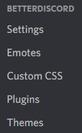

# Installation

::: warning

If you experience any issues following these steps, try the [troubleshooting](./troubleshooting) guide.

:::

## Automatic Installation

### Video

If you prefer a video tutorial, take a look at this:

<iframe style="width: 100%; aspect-ratio: 16 / 9; max-width: 688px;" src="https://www.youtube.com/embed/n_CCYtIZj0Y" title="YouTube video player" frameborder="0" allow="accelerometer; autoplay; clipboard-write; encrypted-media; gyroscope; picture-in-picture" allowfullscreen></iframe>

### Step-by-Step

1. Go to the [BetterDiscord Website](https://betterdiscord.app) and click the big download button. Save this somewhere on your computer.
2. Open the installer you downloaded in the previous step.
3. Accept the license agreement, and click next to proceed.


4. Select `Install` then click the next button to proceed with installation.
5. Select the version of Discord you want to use. If you're not sure what this means, just select `Stable`. Click the install button when ready.
6. Let the installer process the installation. It should tell you when the installation has completed.
7. Verify that BetterDiscord is installed.
  - Open (or switch to) Discord, and open Discord's settings.
  - Check the tabs on the left for a new section called `BetterDiscord` (see below)



8. Enjoy BetterDiscord!


## Command Line Installation

If you're comfortable using a terminal, the BetterDiscord CLI lets you install and update quickly. For full details, see the [CLI guide](../guides/cli).

### Install the CLI

Choose one of these methods:

::: code-group
```bash [npm]
npm install -g @betterdiscord/cli
```

```bash [Homebrew]
brew install betterdiscord/tap/bdcli
```


```bash [winget]
winget install betterdiscord.cli
```

```bash [Go]
go install github.com/betterdiscord/cli@latest
```

```bash [Binary]
# Download the latest release for your platform
# https://github.com/BetterDiscord/cli/releases
```
:::

### Install BetterDiscord

Most people can use the Stable channel:

```bash
bdcli install --channel stable
```

Other channels are available too:

```bash
bdcli install --channel ptb
bdcli install --channel canary
```

If Discord is installed in a custom location, point to it directly:

```bash
bdcli install --path /path/to/Discord
```


Notes:
- If neither `--path` nor `--channel` is specified, it defaults to Stable.
- The `--path` and `--channel` flags are mutually exclusive.


## Manual Installation

::: danger

This section is primarily meant for developers and contributors to BetterDiscord. Users should only do this as a last resort.

:::

For those that can't get the automatic installers to work, those that want more control over their installation, and for developers.

### Prerequisites

- Git - https://git-scm.com/downloads
- Bun - https://bun.com/docs/installation

### Steps

#### 1. Clone the BetterDiscord repository
```bash
git clone --single-branch -b main https://github.com/BetterDiscord/BetterDiscord.git
```
If this fails due to region lock or something similar, you can download a zipped copy directly from https://github.com/BetterDiscord/BetterDiscord/archive/refs/heads/main.zip

#### 2. Enter the directory
```bash
cd BetterDiscord
```

#### 3. Install dependencies
Install BetterDiscord's dependencies
```bash
bun install
```

#### 4. Build BetterDiscord
This will create `injector.js`, `preload.js`, `renderer.js`, and an `/editor` directory in the `dist/` directory.
```bash
bun run build
```

#### 5. Inject into Discord
::: code-group
```bash [Stable]
bun inject
```

```bash [Canary]
bun inject canary
```

```bash [PTB]
bun inject ptb
```
:::
