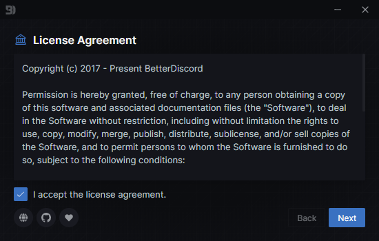

# Installation

:::caution

If you experience any issues following these steps, try the [troubleshooting](./troubleshooting) guide.

:::

## Automatic Installation

### Video

If you prefer a video tutorial, take a look at this:

<iframe width="850" height="478" src="https://www.youtube.com/embed/n_CCYtIZj0Y" title="YouTube video player" frameborder="0" allow="accelerometer; autoplay; clipboard-write; encrypted-media; gyroscope; picture-in-picture" allowfullscreen></iframe>

### Step-by-Step

1. Go to the [BetterDiscord Website](https://betterdiscord.app) and click the big download button. Save this somewhere on your computer.
2. Open the installer you downloaded in the previous step.
3. Accept the license agreement, and click next to proceed.



4. Select `Install` then click the next button to proceed with installation.
5. Select the version of Discord you want to use. If you're not sure what this means, just select `Stable`. Click the install button when ready.
6. Let the installer process the installation. It should tell you when the installation has completed.
7. Verify that BetterDiscord is installed.
  - Open (or switch to) Discord, and open Discord's settings.
  - Check the tabs on the left for a new section called `BetterDiscord` (see below)


8. Enjoy BetterDiscord!


## Manual Installation

For those that can't get the automatic installers to work, those that want more control over their installation, and for developers.

### Prerequisites

- Git - https://git-scm.com/downloads
- Node.js - https://nodejs.org/en/download/
- npm - (comes with node on most systems)
- pnpm - `npm install -g pnpm`

### Steps

#### 1. Clone the BetterDiscord repository
```bash
git clone https://github.com/BetterDiscord/BetterDiscord.git
```
If this fails due to region lock or something similar, you can download a zipped copy directly from https://github.com/BetterDiscord/BetterDiscord/archive/refs/heads/main.zip

#### 2. Enter the directory
```bash
cd BetterDiscord
```

#### 3. Install dependencies
First install `pnpm` if you have not done so already
```bash
npm install -g pnpm
```

Then install BetterDiscord's dependencies
```bash
pnpm install
```

#### 4. Build BetterDiscord

This will create an `injector.js`, `preload.js`, and `renderer.js` in the `dist/` folder.
```bash
pnpm build
```

#### 5. Install to Discord

import Tabs from '@theme/Tabs';
import TabItem from '@theme/TabItem';
import CodeBlock from '@theme/CodeBlock';

<Tabs className="code-tabs">
<TabItem value="stable"><CodeBlock language="bash">pnpm inject</CodeBlock></TabItem>
<TabItem value="canary"><CodeBlock language="bash">pnpm inject canary</CodeBlock></TabItem>
<TabItem value="ptb"><CodeBlock language="bash">pnpm inject ptb</CodeBlock></TabItem>
</Tabs>
