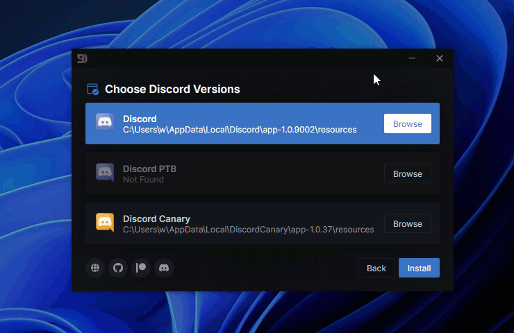
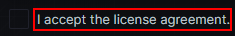

# Troubleshooting

::: warning

If you need help beyond what these docs provide, please contact us in `#support` on our [discord server](https://betterdiscord.app/invite)

:::

## Crashes

Crashing when using BetterDiscord can be frustrating. Here are some helpful tips to solve your issues.

::: details ⚠️ BetterDiscord seems to have crashed your client.

This is a very generic error that could mean any number of things. It also doesn't necessarily mean BetterDiscord was at fault. It could have been a plugin or even Discord itself. It's just difficult for BetterDiscord to tell who is the cause so it catches them all.

Fixing issues like this involves the following:
 - Switching to Stable from Canary or PTB
 - Manually updating library plugins
 - Removing unofficial plugins
 - Rename the plugin folder

 :::

::: details "Well, this is awkward" or "You died, looks like you got slaughtered by an Error Level 9000"

This type of error is usually caused by plugins or BetterDiscord being out of date. Ensure your copy of BetterDiscord and your plugins and keys are up to date.

:::

## Installation

This section goes over common issues and pitfalls when trying to install BetterDiscord.

### General Issues

::: details Cannot select stable, or BetterDiscord not installed after installing

This is usually an issue with Discord moving around its installation location on Windows. Sometimes the installer is unable to differentiate what to do. To fix it, select `Browse` in the installer, then enter `%localappdata%/discord/app-1.0.9006/resources` in the address bar at the top. If this has the same issue repeat this but using `%programdata%/%username%/Discord/app-1.0.9006/resources`

:::

::: details Installer won't open

If you are on Linux try running with the `--no-sandbox`

If the installer does not seem to open, follow these steps:
1. Download and install [7-Zip](https://www.7-zip.org/)
1. Right-click and extract the BetterDiscord installer into a folder.
1. Run the exe found in the folder.

OR

Follow the [manual installation](../getting-started/installation.md#manual-installation) instruction.
:::

::: details Installer is all black

Try one of the following:
 - Right-click the installer and select run as Administrator.
 - Open the command prompt by pressing `win`+`r` type `cmd` and press enter. Then type `ipconfig /flushdns` and press enter in the window that appears.
 - Disable your anti-virus temporarily.

OR

Follow the [manual installation](../getting-started/installation.md#manual-installation) instruction.
:::

::: details Cannot click the agreement checkbox

Click the text next to the checkbox instead, they are connected.

:::

### Specific Errors

::: details ❌ Cannot read property "assets" of undefined" OR installer freezing at "downloading asar file..."

Your installer is out of date, please go to the [BetterDiscord website](https://betterdiscord.app) and download a new one.
:::

::: details ❌ EACCES: permission denied, mkdir or any error where at "shims" there is a "mkdir" error

The Discord installation has been corrupted. Try to reinstall Discord. If Discord fails to reinstall or you still run into this error then your best bet is [cleanly uninstalling Discord](https://discordtips.com/how-to-fully-uninstall-discord/) then installing it again.
:::

::: details ❌ Cannot read property "hasOwnProperty" of undefined error

Fully close Discord. Fully deactivate any VPNs or firewalls. Make sure your installer is up to date. Then try again. If that still doesn't work, see the previous entry about cleanly removing and reinstalling Discord.
:::

::: details ❌ getaddrinfo ENOTFOUND api.github.com

Disable your antivirus or swap your DNS servers. There is a good guide to do the latter found here: https://www.ionos.com/digitalguide/server/configuration/how-to-change-dns-server/
:::
